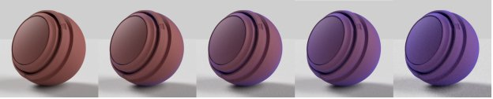
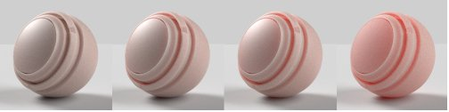

# Adobe Standard Material

>[!NOTE]
>
> 이제 Substance 3D Sampler은 Adobe 표준 재질이 아닌 [OpenPBR](openpbr.md) 재질 모델으로 기본 설정됩니다.

## 표준 재질 속성

## 기본 서피스 특성

**기본 색상**

표면의 색상입니다.

**거칠음**

서피스가 얼마나 매끄럽거나 매트한지 지정합니다.

**금속**

표면의 금속 광택의 정도입니다.

**불투명도**

서피스의 가시성입니다.

**주변 오클루전**

공동의 그림자와 주름으로 인해 빛이 표면에 닿지 않습니다.

**Specular level**

표면에서 빛의 반사 강도입니다.

**Specular edge color**

빛의 반사 색상입니다. 금속 재질의 글랜싱 각도에 영향을 줍니다.

**표준**

범프, 균열 등의 표면 세부 사항을 시뮬레이션합니다.

**보통 비율**

표준 효과의 강도입니다.

**표준 및 Height 결합**

Height 텍스처 위에 표준 텍스처를 적용합니다.

**Height**

범프(bump)나 형상(geometry) 변위를 사용하여 서피스 세부 정보를 생성합니다.

**Height 크기**

장면 단위로 나타낸 Height 비율입니다. 범프 및 변위 모두에 적용됩니다.

**Height 수준**

변위 0을 나타내는 Height 텍스처 값입니다.

**비등방성 수준**

반사하는 양이 서피스를 따라 한 방향으로 늘어납니다.

**비등방성 각도**

비등방성 효과의 시계 반대 방향 회전입니다.

**방출 강도**

표면에서 방출되는 빛의 강도입니다.

**방출 색상**

방출된 빛의 색상입니다.

**광택 불투명도**

표면에 미세한 섬유 또는 퍼즈의 효과를 시뮬레이션합니다.

**광택 색상**

광택 효과의 색상입니다.

**광택 거칠음**

광택 효과의 부드러움입니다.

## 내부 속성

**투명도**

표면을 투과할 수 있는 빛의 양입니다.

**흡수 색상**

색광은 흡수될 때 수렴할 것이다.

**흡수 거리**

빛이 흡수 색상에 도달하기 전에 이동할 장면 단위의 대략적인 거리입니다. 0으로 설정하면 Thickness이 흡수 색상에 영향을 주지 않습니다.

**굴절률**

빛이 개체를 통과할 때 구부러지는 정도입니다.

**분산**

굴절했을 때 색상 스펙트럼이 얼마나 펼쳐지는지 지정합니다.

**서브서피스 분산**

산란은 직진하지 않고 표면 아래를 비춥니다.

**색상 분산**

산란된 빛이 있는 표면 아래의 색깔은 변할 것이다.

**분산 거리**

대략적인 거리 빛은 전체 산란에 도달하기 전에 진행해야 한다.

**분산 거리 눈금**

산란 거리의 승수입니다. 각 색상 채널마다 다를 수 있습니다.

**빨간색 이동**

빨강 조명을 다른 조명 색상보다 더 멀리 이동하도록 설정합니다. 피부에 유용합니다.

**레일리 분산**

주황색 빛을 표면 아래로 더 이동하고 파란색 빛을 적게 이동합니다.

**볼륨 Thickness**

개체의 테두리 상자를 기준으로 하는 서피스의 Thickness 실제 Thickness을 알 수 없는 경우 내부 효과에 사용됩니다.

**볼륨 Thickness 비율**

볼륨 Thickness 승수입니다.

## 코트 속성

**코트 불투명도**

재질 위의 레이어를 시뮬레이션합니다. 명확한 코트, 래커 및 바니시를 만드는 데 사용됩니다.

**코트 색상**

코트의 색상입니다.

**코트 거칠음**

코트 표면의 매끄럽거나 매트한 정도를 지정합니다.

**굴절율** 코팅

빛이 코트를 통과할 때 양이 휘어집니다.

**코트 Specular level**

털의 반짝이는 각도에서 빛의 반사 강도입니다.

**정상 외투**

코트 표면의 범프 및 균열과 같은 표면 세부 사항을 시뮬레이션합니다.

**보통 비율 적용**

코트 표준 효과의 강도입니다.
