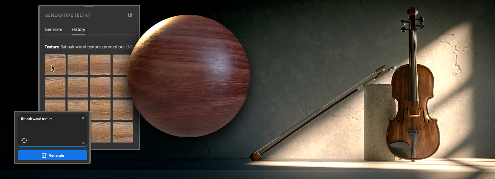

# 생성형 워크플로우

Substance 3D Sampler에서는 현재 베타 버전인 텍스트-텍스처, 텍스트-패턴, 이미지-텍스처의 세 가지 생성형 기능을 사용하여 신속하게 반복하고 새로운 아이디어를 쉽게 시도할 수 있습니다.

## 텍스트-텍스처

텍스트 텍스처를 사용하면 텍스트 프롬프트에서 텍스처를 생성하기 위해 아이디어를 빠르게 시도할 수 있습니다.

Text-to-Texture를 사용하려면:

1. 왼쪽 도구 모음에서 <b>생성형(Beta) </b>패널을 엽니다.
1. 유형 드롭다운 목록에서 &quot;<b>텍스처</b>&quot;를 선택합니다.
1. 만들려는 텍스처를 설명하는 텍스트 프롬프트를 작성합니다.
1. 텍스처 생성을 시작하려면 <b>생성</b>을 사용하십시오. 이 기능을 사용할 때마다 네 가지 변형이 생성됩니다.
1. 3D 또는 2D 보기에서 원하는 결과를 끌어다 놓아 <b>재질 만들기 템플릿</b>을 열거나 전용 버튼을 통해 <b>레이어에 추가</b>할 수 있습니다. <b>에셋</b>에 결과를 추가하여 나중에 손쉽게 찾을 수도 있습니다.

그런 다음 다른 텍스처에서처럼 결과를 사용할 수 있습니다. 예를 들어 [이미지-재질]을 실행하고 그 위에 필터를 더 추가할 수 있습니다.

### Text-to-Pattern

텍스트-패턴 을 사용하면 텍스트 프롬프트에서 패턴을 빠르게 생성하여 원하는 표면에 적용할 수 있습니다.

Text-to-Pattern을 사용하려면

1. 왼쪽 도구 모음에서 <b>생성형(Beta) </b>패널을 엽니다.
1. 유형 드롭다운 목록에서 &quot;<b>패턴</b>&quot;을(를) 선택합니다.
1. 만들려는 패턴을 설명하는 텍스트 프롬프트를 작성합니다.
1. <b>생성</b>을 사용하여 패턴 생성을 시작합니다. 이 기능을 사용할 때마다 네 가지 변형이 생성됩니다.
1. <b>패턴 필터</b>의 입력으로 추가하거나 전용 버튼을 통해 <b>레이어</b>에 직접 추가할 수 있습니다. <b>에셋</b> 라이브러리에 결과를 추가하여 나중에 손쉽게 찾을 수도 있습니다.

#### 이미지를 텍스처로

<b>이미지-텍스처</b>는 비율에 관계없이 모든 <b>참조 이미지</b>에서 <b>정사각형과 타일링 텍스처</b>의 네 가지 명제를 만듭니다. 이미 있는 텍스처의 <b>변형을 생성</b>하거나 소유하고 있는 참조 이미지에서 바로 사용할 수 있는 텍스처를 만들 수 있습니다.

Image-to-Texture를 사용하려면:

1. 왼쪽 도구 모음에서 <b>생성형(Beta) </b>패널을 엽니다.
1. 유형 드롭다운 목록에서 &quot;<b>텍스처</b>&quot;를 선택합니다.
1. <b>이미지를 텍스트 필드</b>에 끌어다 놓거나 &quot;이미지 추가&quot; 아이콘을 클릭하여 파일 탐색기를 열고 참조로 사용할 이미지를 선택합니다.
1. <b>생성</b>을 사용하여 참조 이미지에서 영감을 받은 텍스처를 생성합니다. 이 기능을 사용할 때마다 네 가지 변형이 생성됩니다.
1. 3D 또는 2D 보기에서 원하는 결과를 끌어다 놓아 <b>재질 만들기 템플릿</b>을 열거나 전용 버튼을 통해 <b>레이어</b>에 추가할 수 있습니다. <b>에셋</b>에 결과를 추가하여 나중에 손쉽게 찾을 수도 있습니다.

## 텍스처 또는 패턴 프롬프트 작성을 위한 팁

생성할 <b>텍스처</b> 또는 <b>패턴</b>을 설명하는 <b>단어 또는 식</b>에 추가합니다. 구체화하면 생성된 결과를 더 잘 제어할 수 있습니다.

하나 또는 여러 개의 특정 프롬프트를 <b>제외</b>하려면 프롬프트를 처리하는 동안 피하도록 최대 10개의 단어 또는 표현식을 추가할 수 있습니다. 제외할 단어나 식 앞에 &quot;<b>—no</b>&quot;을(를) 작성합니다. 

생성형(Beta) 패널의 <b>샘플</b>을 사용하여 신속한 아이디어 탐색을 시작할 수도 있습니다.

## 생성형 크레딧

Sampler 생성형 기능은 Beta 버전에서는 크레딧을 사용하지 않습니다.

Adobe 도구에서 생성형 크레딧이 작동하는 방식에 대한 최신 정보는 <b>생성형 크레딧 FAQ</b>를 참조하세요.
