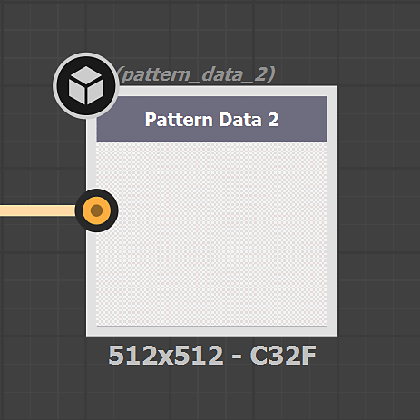

# 텍스처 생성기

텍스처 생성기를 사용하면 <b>매개 변수 노이즈, 패턴 </b>및<b> 그런지</b> 옵션을 사용하여 재질 생성을 보다 효율적으로 제어할 수 있습니다. 생성된 이미지는 마스크 또는 채널 맵에 사용할 수 있습니다.

<table>
<tr style="border: 0;">
<td style="border: 0;" valign="top">

</td>
<td style="border: 0;" valign="top">

텍스처 생성기는 Substance 3D Sampler의 에셋 유형입니다. [텍스처 생성기] 아이콘을 사용하여 [에셋] 패널에서 필터링할 수 있습니다.

</td>
</tr>
</table>

## 텍스처 생성기를 사용하는 방법

### 채널 맵

3D 보기, 2D 보기 또는 레이어 스택에서 텍스처 생성기를 드래그하여 놓고 사용할 채널을 선택합니다.

오른쪽 입력에 텍스처 생성기가 있는 스택에 채우기 필터가 생성됩니다. [속성] 패널에서 [텍스처 생성기] 속성에 액세스할 수 있습니다.

#### 필터

<b>쪽매</b>와 같은 일부 필터는 패턴 마스크에 기본적으로 텍스처 생성기를 사용합니다. 다른 작업은 <b>패턴</b> 필터와 같은 이미지 또는 텍스처 생성기로 수행할 수 있습니다.\
필터에서는 모든 이미지 속성(예: <b>사용자 지정 마스크</b>)에서 텍스처 생성기를 사용할 수 있습니다.

필터는 이미지 속성을 클릭할 때 새 에셋 선택기에 표시되는 함께 사용할 생성기를 제안할 수 있습니다.

#### 튜토리얼

[학습 페이지](https://creativecloud.adobe.com/cc/learn/app/substance-3d-sampler)에서 Substance 3D Sampler의 모든 튜토리얼을 찾을 수 있습니다.

[Sampler 텍스처 생성기를 사용한 텍스타일 디자인](https://creativecloud.adobe.com/cc/learn/substance-3d-sampler/web/fabric-texture-generator?locale=en)

[Substance 3D Sampler을 사용한 탄소 섬유 소재(분)](https://creativecloud.adobe.com/cc/learn/substance-3d-sampler/web/create-carbon-fiber-material?locale=en)

[Substance 3D Sampler을 사용한 격자무늬 패브릭 재질](https://creativecloud.adobe.com/cc/learn/substance-3d-sampler/web/create-plaid-fabric-material?locale=en)

## 사용자 지정 텍스처 생성기를 만드는 방법

레이어 스택 작업의 *가져오기* 단추를 통해 Adobe Substance 3D Designer으로 만든 텍스처 생성기를 가져올 수 있습니다. Sampler으로 가져올 때 올바르게 작동하려면 Designer에서 특정 방식으로 빌드해야 합니다.

### 유형

&quot;텍스처 생성기&quot;를 그래프<b> 형식</b>(으)로 선택합니다.

#### 출력

필터의 필터 출력 노드에는 <b>식별자</b> 또는 <b>사용량 </b>이(가) 정의되어 있어야 합니다.

* 텍스처 생성기의 기본 출력은 사용할 수 없습니다. 그러면 3D Sampler에서 주 출력으로 인식할 수 있습니다.

<table>
<tr style="border: 0;">
<td style="border: 0;" valign="top">

</td>
<td style="border: 0;" valign="top">

</td>
</tr>
</table>

* 텍스처 생성기의 <b>보조 출력</b>을 사용하려면 <b>사용</b>이 필요합니다.\
  그룹 이름은 기본 출력 <b>식별자</b>가 됩니다.

>[!NOTE]
>
> 함께 사용할 필터와 텍스처 생성기를 직접 만드는 경우 <b>출력 식별자</b>에 따라 <b>사용자 지정 사용</b>을 사용하는 것이 좋습니다.

<table>
<tr style="border: 0;">
<td style="border: 0;" valign="top">

</td>
<td style="border: 0;" valign="top">

</td>
</tr>
</table>

>[!IMPORTANT]
>
> 사용자 정의 텍스처 생성기를 필터 권장 에셋 목록에 포함시키려면 Substance 그래프에 다음 사용자 데이터를 추가해야 합니다.
> 
> alchemist::suggestedfilters=[FilterName,FilterName2];

>[!NOTE]
>
> 사용자 데이터는 [사용자 지정 필터](../filters/custom-filters.md)와 함께 사용할 수 있습니다.

#### 형식

필터를 Substance 보관 파일(.sbsar)로 내보내기

>[!NOTE]
>
> Sampler에서 직접 필터를 제어하기 위해 필터 매개 변수를 표시할 수 있습니다. [여기](https://experienceleague.adobe.com/ko/docs/substance-3d-designer/using/substance-graphs/manage-parameters/exposing-a-parameter)에서 방법 보기
