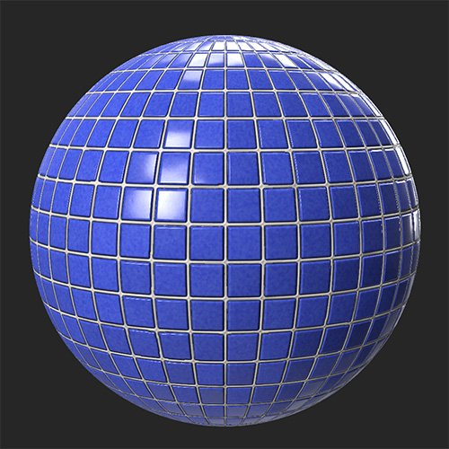

# 명도/대비

<table>
<tr style="border: 0;">
<td width="41.60%" style="border: 0;" valign="top">

**인:** 조정

</td>
<td width="58.30%" style="border: 0;" valign="top">

## 설명

이름에서 알 수 있듯이 명도/대비 필터를 사용하면 재질의 명도 및 대비를 조정할 수 있습니다. 명도/대비 필터를 사용하여 특정 채널을 대상으로 지정할 수 있습니다. 예를 들어, 거칠기 채널의 대비나 방출 채널의 명도를 높일 수 있습니다.

아래 이미지에서는 타일 재질의 명도와 대비를 높이는 데 **명도/대비 필터**&#x200B;가 사용되었습니다.

<table>
<tr style="border: 0;">
<td style="border: 0;" valign="top">

</td>
<td style="border: 0;" valign="top">

</td>
</tr>
</table>

</td>
</tr>
</table>

## 매개변수

**기본 매개 변수**

* **채널 선택**:\
  필터가 영향을 미치는 채널을 선택합니다. 참고: 일반 채널은 대부분의 채널과 다르게 동작하므로 [명도/대비] 필터를 사용하여 수정할 수 없습니다.
* **밝기**: -1~1\
  선택한 채널의 명도 수정
* **대비**: -1 대 1\
  선택한 채널의 대비 수정

**마스크**

* **사용자 지정 마스크 사용**: 전환\
  사용자 정의 마스크 사용을 활성화하거나 비활성화합니다. 활성화하면 다음 매개변수가 나타납니다.
  * **마스크**: 이미지/브러시\
    마스크로 사용할 이미지를 선택하거나 브러시를 사용하여 2D 보기에서 직접 사용자 정의 마스크를 칠합니다
  * **사용자 지정 마스크 - 흐림 효과**: 0-1\
    마스크에 흐림 효과 적용
  * **사용자 지정 마스크 - 반전**: 전환\
    마스크 반전
