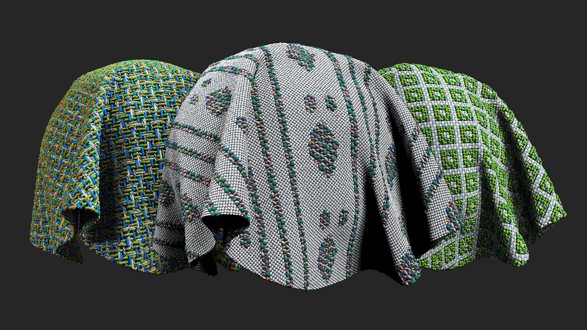

# 헝겊 위브

<table>
<tr style="border: 0;">
<td width="41.60%" style="border: 0;" valign="top">

</td>
<td width="58.30%" style="border: 0;" valign="top">

## 설명

맞춤 직조 패턴으로 천 직물을 디자인합니다.

</td>
</tr>
</table>

매개변수

**기본 매개 변수**

* **맞춤 직조 그리기:** 2D 뷰포트에서 직조를 그립니다.
* **색상 사용자 지정 직조:** 2D 뷰포트에 색상을 그려 직조에 색조를 더합니다.
* **직조 패턴:** 직조 패턴을 설정합니다.
* **패턴 크기:** 뒤틀기(수직 섬유) 및 씨실(수평 섬유)을 조정하는 패턴의 크기를 설정합니다.
* **크기 배율:** 섬유만 곱합니다(마스크는 곱하지 않음).
* **크기 승수에 대한 Weave 잠금:** 토글\
  직조 및 오픈 색상 및 마스크 제한에 크기 승수를 적용합니다.
* **사용자 지정 색상을 크기 승수로 잠그기:** 전환\
  사용자 정의 색상에 크기 승수를 적용합니다.
* **크기 승수에 마스크 잠금:** 전환\
  [크기 승수]를 사용자 정의 마스크에 적용합니다.
* **섬유 장력:** 뒤틀기 0-1, 위사 0-1\
  섬유의 장력을 설정합니다.
* **색상 모드 뒤틀기:** 단색, 이색 또는 없음 중에서 설정합니다.
* **색상 모드 위사:** [유니컬러], [쌍컬러] 또는 [없음] 중에서 설정합니다. 결과를 보여 주는 이미지를 추가합니다.

**뒤틀기 1**

* **색상 양:** 1~4\
  스레드에 사용되는 색상 수를 설정합니다.
* **너비:** 0-1\
  줄 바꿈 스레드의 너비를 설정합니다.
* **오프셋:** 0-1\
  X 및 Y축에서 그런지 맵을 오프셋합니다.
* **스레드:** 스레드 유형을 설정합니다.
* **파이버 양:** 0-8\
  스레드에 포함된 섬유 수를 설정합니다.
* **섬유 마무리:** 섬유의 품질을 설정합니다.

**위사 1**

* **색상 양:** 1~4\
  스레드에 사용되는 색상 수를 설정합니다.
* **너비:** 0-1\
  줄 바꿈 스레드의 너비를 설정합니다.
* **오프셋:** 0-1\
  X 및 Y축에서 그런지 맵을 오프셋합니다.
* **스레드:** 스레드 유형을 설정합니다.
* **파이버 양:** 0-8\
  스레드에 포함된 섬유 수를 설정합니다.
* **섬유 마무리:** 섬유의 품질을 설정합니다.

**고급**

* **혼합 모드**&#x200B;**:** 기본 색상 채널의 혼합 모드를 선택합니다. 혼합 모드를 변경하면 직물 직조의 모양이 크게 변경될 수 있습니다.
* **불완전 강도:** 0-1\
  스레드 결함 강도를 설정합니다.
* **표준 강도:** 0-2\
  표준 맵의 강도를 조정합니다.
* **Height 위치:** 0-1\
  전체 재질의 Height을 오프셋합니다.

**마스크**

* **사용자 지정 마스크 사용:** 토글\
  사용자 정의 마스크 사용을 활성화하거나 비활성화합니다. 활성화하면 다음 매개변수가 나타납니다.
* **사용자 지정 마스크 - 흐림 효과:** 0-1\
  마스크를 흐리게 합니다.
* **사용자 지정 마스크 - 반전:** 전환\
  마스크를 반전합니다.
