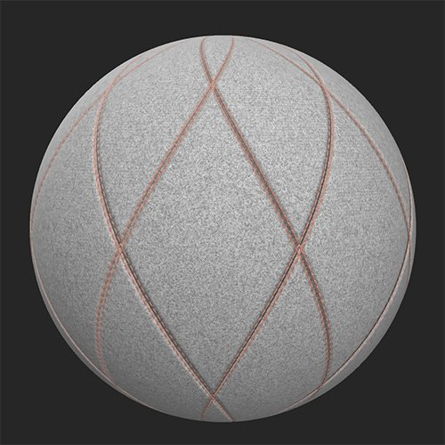

# 퀼트 스티치

<table>
<tr style="border: 0;">
<td width="41.60%" style="border: 0;" valign="top">

**내부:** 생성기

</td>
<td width="58.30%" style="border: 0;" valign="top">

## 설명

이 필터를 사용하여 재질에 스티칭된 퀼트 패턴을 에뮬레이션합니다.

***퀼트 스티치 필터**를 적용하기 전과 적용한 후*

<table>
<tr style="border: 0;">
<td style="border: 0;" valign="top">

{width="200px"}

</td>
<td style="border: 0;" valign="top">

{width="200px"}

</td>
</tr>
</table>

</td>
</tr>
</table>

## 매개변수

**기본 매개 변수**

* **임의화**:\
  임의식은 이 필터에서 임의성을 사용하는 다른 매개 변수의 임의값을 결정합니다.
* **패턴 선택**:\
  따를 스티칭/퀼트의 패턴 스타일을 선택합니다
* **금액**: 1-5\
  패턴 타일링 양 제어
* **회전**:\
  패턴 회전
* **Topstitch**: 전환\
  상단 스티치를 추가하고 관련 매개 변수 섹션을 볼 수 있도록 합니다.
* **Seam**: 토글\
  Seam을 추가하고 관련 매개 변수 섹션을 볼 수 있습니다.
* **퀼트**: 토글\
  퀼트를 추가하고 관련 매개변수 섹션을 확인하려면 활성화합니다
* **가장자리 페인트**: 토글\
  퀼트 단면 사이의 모서리를 고정하고 관련 매개변수 단면을 볼 수 있도록 활성화합니다
* **고급**: 토글\
  **고급** 매개 변수 보기 사용

**상단 스티치**

* **위 스티치 색상**: 색상 선택\
  토스티치에 사용되는 스레드의 색상 설정
* **Topstitch 오프셋**: 0-1\
  퀼트 영역의 가장자리에서 톱 스티치 오프셋
* **Topstitch 회전**: 0-1\
  위쪽 스티치를 구성하는 스티치의 방향 변경
* **상단 스티치 눈금**: 0-1\
  각 치수(폭, 길이, Height)에서 상단 스티치의 크기를 조정합니다
* **천공 강도**: 0-1\
  토스티치로 인한 퀼트 안으로 들여쓰기를 조정합니다
* **위 스티치 거칠음**: 0-1\
  스레드의 거칠음 조정
* **Topstitch Metallic**: 0-1\
  스레드의 금속성 값 조정

**Seam**

* **연결** **선택**:\
  사용할 솔기 스타일 선택
* **솔기 강도**: 0-1\
  솔기의 표준 및 Height 강도를 수정합니다
* **스트레치 강도**: 0-1\
  직물의 늘임이 솔기에 미치는 영향의 정도를 조정합니다. 이 효과는 매우 미묘합니다.

**퀼트**

* **퀼트 유형**:\
  사용할 퀼트 스타일 선택
* **퀼트 강도**:\
  퀼트 효과의 표준 및 Height 강도 조정

**가장자리 페인트**

* **가장자리 선택**:\
  통증이 기본 재질의 일반 및 Height 세부 사항을 재정의하는지 여부를 선택합니다
* **가장자리 색상**: 색상 선택\
  페인트 색상 선택
* **가장자리 거칠음**: 0-1
* **가장자리 금속**: 0-1

**고급**

* **기본 재질 Height**: 0-1\
  기본 재질의 Height 맵 강도 조정
* **표준 강도**: 0-1\
  **퀼트 스티치** 필터로 인해 표준 맵의 강도가 변경됩니다. 이는 기본 재질의 표준에는 영향을 주지 않습니다.
