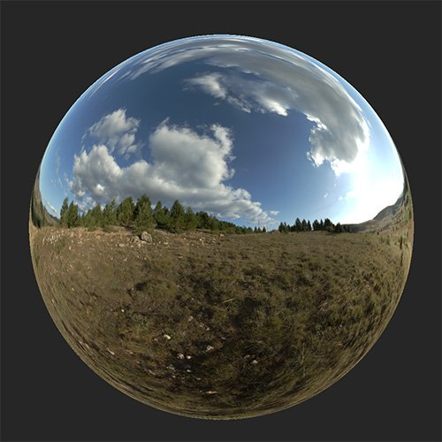

# Color Temperature Adjustment

<table>
<tr style="border: 0;">
<td width="41.60%" style="border: 0;" valign="top">

**내부:** HDRI 도구

</td>
<td width="58.30%" style="border: 0;" valign="top">

## 설명

환경 조명의 온도를 조정합니다.

아래 이미지는 **Color Temperature Adjustment 필터**&#x200B;를 사용하여 환경 조명의 빛을 더 따뜻하거나 차갑게 보이게 하는 방법을 보여 줍니다.

<table>
<tr style="border: 0;">
<td style="border: 0;" valign="top">

{width="200px"}

</td>
<td style="border: 0;" valign="top">

{width="200px"}

</td>
</tr>
</table>

</td>
</tr>
</table>

## 매개변수

**기본 매개 변수**

* **온도**: -1 - 1\
  온도를 더 차갑거나 따뜻하게 수정합니다.
* **마젠타-녹색**: -1 ~ 1\
  자홍-녹색 비율에서 색상 수정

**마스크**

* **사용자 지정 마스크**: 토글\
  사용자 정의 마스크 사용을 활성화하거나 비활성화합니다. 활성화하면 다음 매개변수가 나타납니다.
  * **마스크**: 이미지/브러시\
    마스크로 사용할 이미지를 선택하거나 브러시를 사용하여 2D 보기에서 직접 사용자 정의 마스크를 칠합니다
  * **사용자 지정 마스크 - 흐림 효과**: 0-1\
    마스크에 흐림 효과 적용
  * **사용자 지정 마스크 - 반전**: 전환\
    마스크 반전
