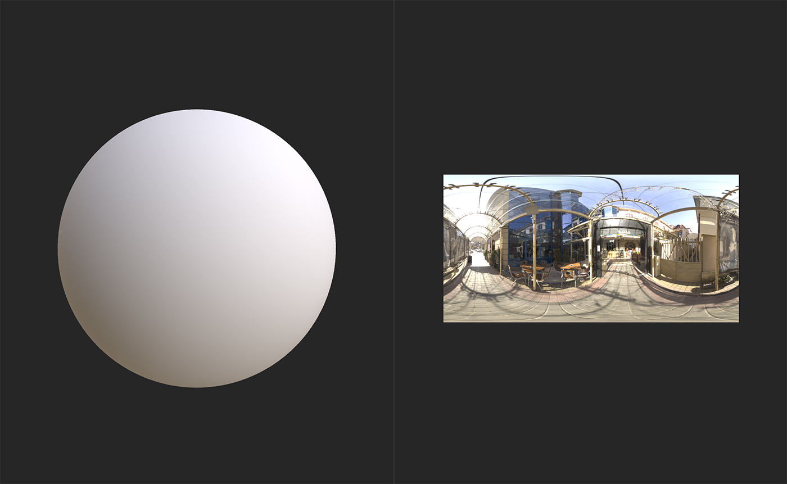

# 라인 라이트

<table>
<tr style="border: 0;">
<td width="41.60%" style="border: 0;" valign="top">

**내부:** HDRI 도구

</td>
<td width="58.30%" style="border: 0;" valign="top">

## 설명

환경 조명에 **선 조명**&#x200B;을 추가합니다.

아래 이미지는 **선 조명**&#x200B;을 사용하여 환경의 조명을 조정하는 방법을 보여줍니다.

위 이미지는 환경 조명을 수정하지 않은 구를 보여줍니다.

**선 조명**&#x200B;을 추가한 후 구의 모양이 눈에 띄게 변경되었습니다.

</td>
</tr>
</table>

## 매개변수

**기본 매개 변수**

* **노출(EV)**: 0-10\
  빛의 노출이나 명도를 조정합니다.
* **모양 색상 모드**:\
  조명의 색상을 결정하는 데 사용할 방법을 선택합니다. 이 선택 항목에 따라 사용 가능한 매개 변수가 변경됩니다.
  * **온도(켈빈)**
    * **온도**: 1000 - 27000\
      조명의 온도를 조정합니다.
  * **RGB**
    * **색상**: 색상 선택\
      조명의 색상을 선택합니다.
  * **이미지 입력**
    * **모양 이미지 입력**: 이미지/브러시\
      색상으로 사용할 이미지를 가져옵니다. 브러시 도구를 사용하여 **2D 보기**&#x200B;에서 바로 페인트할 수 있지만 이 필터를 사용하면 예기치 않은 결과가 발생할 수 있습니다.
  * **샘플 배경**
    * 샘플 배경은 새 매개 변수를 사용할 수 있게 하지 않습니다. 대신 배경 값을 밝은 색상으로 사용합니다.
* **위치 모드**:\
  조명 위치를 결정하는 데 사용되는 방법을 변경합니다. **위치 좌표** 섹션의 매개 변수는 선택 항목에 따라 변경됩니다. **세계 위치**&#x200B;를 선택하면 핸들이 **2D 보기**&#x200B;에서 사라지고 대신 **위치 좌표**&#x200B;의 매개 변수를 사용하여 조명의 위치를 수정합니다.

**모양**

* **선 회전**: 0-1\
  빛 회전
* **선 Thickness**: 0-1\
  빛을 구성하는 선의 Thickness을 조정합니다.
* **패턴**:\
  선 모양 변경
* **패턴 경도**: 0-1\
  빛의 가장자리 부드럽게 하기
* **패턴 UV 모드**:\
  조명의 기반이 되는 패턴의 방식을 수정합니다. **스트레치**&#x200B;는 선 끝점과 일치하도록 전체 모양을 확장합니다. **중간만 늘이기**&#x200B;는 선의 끝이 왜곡되지 않게 하면서 모양의 중간을 늘립니다. **반복 + 간격**&#x200B;은 선 길이를 따라 모양의 스탬프를 만들고 간격을 관리하기 위해 추가 매개 변수를 추가합니다.
  * **패턴 반복 간격**: 0-1\
    모양 인스턴스 사이의 간격 폭 조정

**위치 좌표**

사용 가능한 매개 변수는 **기본 매개 변수 > 위치 모드**&#x200B;에 대해 선택한 내용에 따라 다릅니다. **지표/천장** 또는 **원점으로부터의 거리**&#x200B;을 선택하면 다음 매개 변수를 사용할 수 있습니다.

* **선 절대 Height**: 0-1\
  빛이 카메라에서 얼마나 멀리 떨어져 있는지를 변경합니다.
* **카메라 위치**: 0-1\
  X, Y 및 Z축의 빛에 대한 카메라의 상대 위치를 조정합니다.

**기본 매개 변수 > 위치 모드**&#x200B;에서 **세계 위치**&#x200B;를 선택하면 다음 매개 변수를 사용할 수 있습니다.

* **위쪽 벡터**:\
  위쪽으로 방향을 바꾸세요
* **포인트 1 세계 위치**: -2 - 2\
  X, Y 및 Z축에서 선의 첫 번째 점 위치를 조정합니다.
* **포인트 2 세계 위치**: -2 - 2\
  X, Y 및 Z축에서 선의 두 번째 점 위치를 조정합니다.
* **카메라 위치**: 0-1\
  X, Y 및 Z축의 빛에 대한 카메라의 상대 위치를 조정합니다.

**배경**

* **지표 격자 표시**: 토글\
  지표 격자를 표시하거나 숨깁니다.
* **지표 클리핑 사용**: 토글\
  조명이 지면을 통과할 수 있는지 여부를 선택합니다. 활성화되면 다음 컨트롤이 나타납니다.
  * **지표 Height**: -2 - 2\
    빛을 클리핑하기 위해 지면의 Height을 조정합니다.
* **배경 감마**:\
  배경 감마를 결정하는 데 사용할 색상 시스템을 선택합니다.
