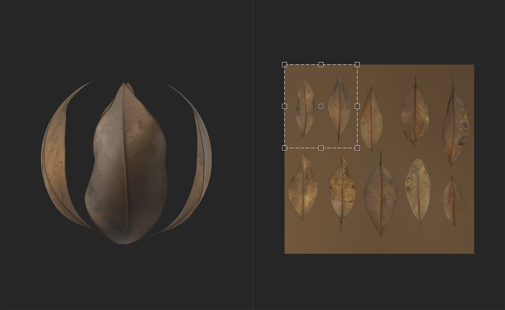

# 자르기 도구

<table>
<tr style="border: 0;">
<td width="41.60%" style="border: 0;" valign="top">

**내부:** 도구

</td>
<td width="58.30%" style="border: 0;" valign="top">

## 설명

**자르기 도구**&#x200B;를 사용하여 이미지 또는 재질의 자르기를 조정합니다. **자르기 도구**&#x200B;는 **변형 도구**&#x200B;와 매우 유사하게 작동합니다. 0&rbrace;변환 도구&#x200B;**를 사용하면 기본 이미지에 대해 하나의 방식으로 변경되어**&#x200B;이(가) 동작하므로 변환 상자의 비율을 늘리면 기본 이미지의 크기가 늘어납니다. **자르기 도구**&#x200B;를 사용하면 이 관계가 반전되어 [자르기] 상자의 비율을 늘리면 기본 이미지의 크기가 줄어듭니다. 따라서 **자르기 도구**&#x200B;를 사용할 때는 기본 재질 출력 대신 레이어 입력을 표시하도록 **2D 보기**&#x200B;을 설정하는 것이 좋습니다.

**자르기 도구**&#x200B;는 비표준 종횡비가 있는 이미지를 조정할 때 유용합니다. 예를 들어 자르기 도구를 사용하여 **속성 패널**&#x200B;의 입력 크기 매개 변수를 통해 가져온 이미지의 비율을 조정할 수 있습니다.

>[!NOTE]
>
> **자르기 도구**&#x200B;는 이미지 또는 재질에서 작동할 수 있습니다. 이미지 또는 스캔 채널이 **자르기 레이어** 아래 레이어 스택에 있는 경우 **자르기 필터**&#x200B;가 스캔 채널에 적용됩니다. 이미지 또는 스캔 채널이 없으면 **자르기 필터**&#x200B;에서 재질을 수정합니다.

아래 이미지에서는 **자르기 도구**&#x200B;의 작동 상태를 확인할 수 있습니다.

**2D 보기**&#x200B;의 핸들이 입력의 출력 영역을 표시하도록 2D 보기가 레이어 입력을 표시하도록 설정되어 있습니다.

</td>
</tr>
</table>

## 매개변수

**기본 매개 변수**

* **입력 크기**: 0-8192\
  X 및 Y축에서 입력 크기를 픽셀 단위로 조정합니다.

**고급 매개 변수**

* **필터링**:\
  크기가 조정된 픽셀에 적용되는 필터링 방법을 선택합니다. 쌍선형 필터링은 픽셀을 서로 흐리게 하고 최단값 필터링은 픽셀의 가장자리를 유지합니다.
* **자르기 자르기**: 0-1\
  변환의 매트릭스 값을 수정합니다. 이러한 값을 편집하면 회전 및 비율을 보다 정확하게 제어할 수 있고 자르기 핸들을 기울일 수도 있습니다.
* **자르기 오프셋**: 0-1\
  자르기를 시작 위치에서 옵셋합니다.

## 사용 안내서

>[!NOTE]
>
> 자르기 필터는 자체 해상도가 있으며, 자른 재질 또는 이미지에 따라 적절한 해상도를 자르고 출력합니다. 최상의 결과를 얻으려면 위의 레이어를 [입력 최대]에 배치하고 [확대]를 사용하여 최종 결과를 확대하십시오.

**자르기 도구**&#x200B;를 클릭하여 새 자르기 필터 레이어를 레이어 스택 맨 위에 추가합니다.

자르기 필터 레이어를 만들거나 선택하면 **2D 보기**&#x200B;가 자동으로 열립니다. [자르기] 레이어가 선택된 상태에서 **2D 보기**&#x200B;의 위쪽에 도구 모음이 나타납니다.

## 기능

>[!NOTE]
>
> 자르기 필터는 요청한 이동, 크기 조절 또는 회전을 반대로 수행합니다. [자르기] 필터가 제대로 작동하지 않는 경우 해당 필터가 더 유용한 것처럼 느껴질 수 있습니다.

### 이동

레이어를 이동하려면 다음을 수행하십시오.

1. 마우스를 상자 안에 마우스 가져다 놓으십시오
1. 커서가 네 개의 화살표로 변경됩니다.
1. 변환 상자를 클릭하고 드래그합니다.

### 비율

레이어 비율을 조정하려면 다음을 수행하십시오.

1. 변환 상자의 핸들 중 하나 또는 모퉁이에 마우스를 가져다 댑니다.
1. 그러면 커서가 네 개의 화살표로 바뀝니다.
1. 변환 상자를 클릭하고 드래그합니다.

>[!NOTE]
>
> 변환 상자의 핸들은 한 번에 두 개의 크기를 조정할 수 있고, 변환 상자의 핸들은 한 치수로 크기를 조정할 수 없도록 제한됩니다.

### 회전

레이어를 회전하려면:

1. 마우스를 변환 상자 밖에 있지만 **2D 보기** 안에 가져갑니다.
1. 커서 옆에 작은 가로 화살표가 나타납니다.
1. 변환 상자를 클릭하고 드래그합니다.

>[!NOTE]
>
> 작은 원 상자의 중심에서 회전 중심을 드래그하여 변경할 수 있습니다. 이 원을 중심으로 회전

## 도구 모음

{width="200px"}

도구 모음에는 다음과 같은 단축키가 포함되어 있습니다.

* 정사각형 만들기: 현재 변환의 비율을 조정하여 정사각형으로 만듭니다.
* 회전 +90°(오른쪽): 시계 방향으로 90° 회전.
* -90° 회전(왼쪽): 시계 반대 방향으로 90° 회전.
* 회전 중심 재설정: 회전 중심을 변환 상자의 중심으로 재설정합니다.
* 변환 재설정: 변환을 기본 위치로 재설정합니다.
