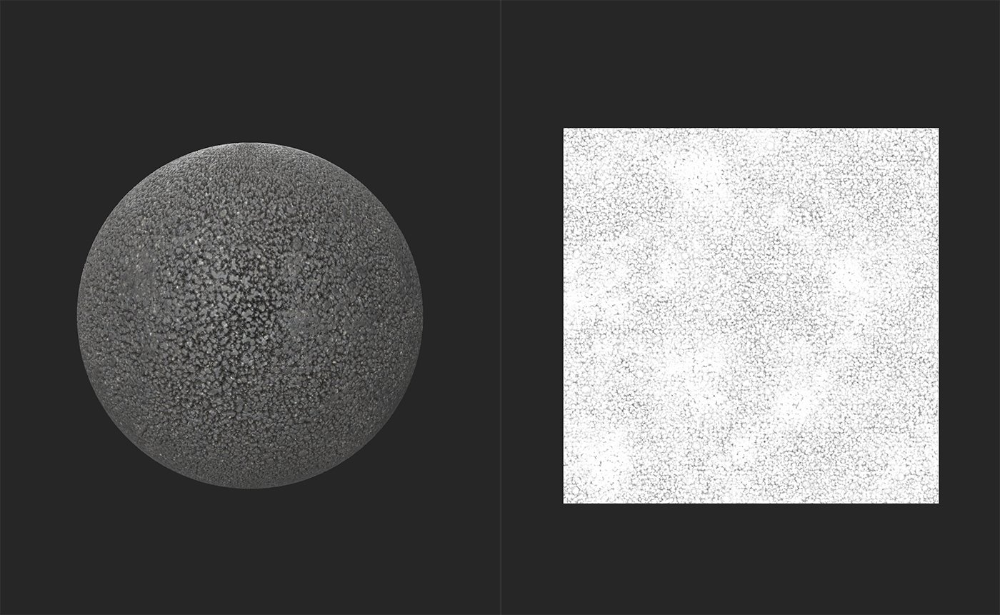

# AO로 Height

<table>
<tr style="border: 0;">
<td width="41.60%" style="border: 0;" valign="top">

**내부:** 도구

</td>
<td width="58.30%" style="border: 0;" valign="top">

## 설명

Height 및 일반 데이터에서 앰비언트 오클루전 맵을 생성합니다.

아래 이미지에서 AO 필터 **Height** 결과를 확인하십시오.

위의 이미지에서 **2D 보기**&#x200B;는 Height 맵을 표시합니다. 재질에 이 이미지의 엠비언트 오클루전 정보가 포함되지 않습니다.

이 이미지에서 앰비언트 오클루전 맵은 **AO 필터 Height**&#x200B;에 의해 만들어졌으며 **2D 보기**&#x200B;에 표시됩니다. 주변 오클루전은 일반적으로 미세한 효과이므로 이 재질에서 보는 것은 쉽지 않습니다. 재질에 **AO 필터 Height**&#x200B;을 사용하여 AO 강도를 높이고 주변 오클루전으로 작업할 수 있도록 만들어 보세요.

</td>
</tr>
</table>

## 매개변수

**기본 매개 변수**

* **모드**:\
  Height 채널에서 데이터를 생성할 것인지, 일반 채널에서 데이터를 생성할 것인지 또는 두 채널 모두에서 데이터를 생성할 것인지 선택합니다.
* **주변 오클루전 - 강도**: 0-1\
  생성된 AO 데이터의 강도 조정
* **주변 오클루전 - 스프레드**: 0-1\
  생성된 AO 데이터의 반경 조정
