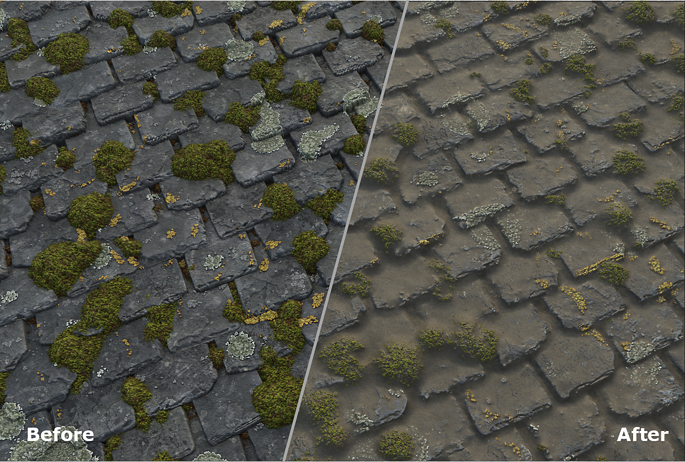
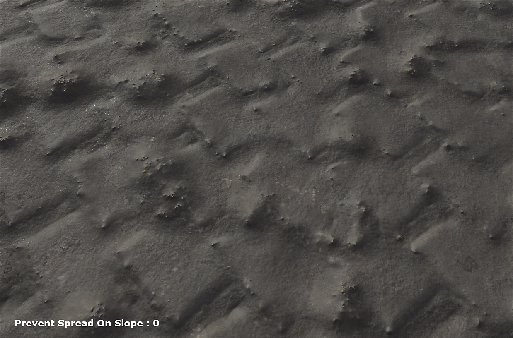
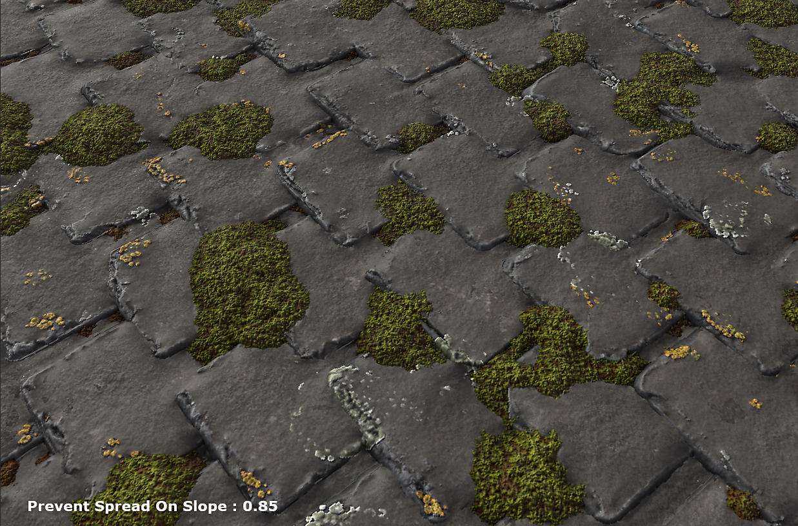

# Dust

## 프레젠테이션

Dust 스플래터 레이어로 Dust을 재질에 추가하고 Dust 스프레드 방식을 정의할 수 있습니다.

## 사용

### 어떻게 사용합니까?

* Dust 스플래터 레이어 추가
* 원하는 효과를 얻으려면 양, 스프레드 대비 및 색상을 설정합니다

#### 언제 사용합니까?

Dust 스플래터를 재질 상단에 추가할 수 있습니다. 이를 사용하여 캐비티를 매끄럽게 하거나 재질의 여러 요소가 함께 작동하도록 할 수 있습니다.

#### 매개변수

* Dust 수량: 추가할 Dust 수량을 정의합니다.
* Dust 깊이: Dust 깊이 정의
* 스프레드 대비: Dust 전환의 선명도를 정의합니다.
* 경사에서 스프레드 방지: 경사에서 Dust이 스프레드 되지 않도록 합니다

<table>
<tr style="border: 0;">
<td style="border: 0;" valign="top">

</td>
<td style="border: 0;" valign="top">

</td>
</tr>
</table>
