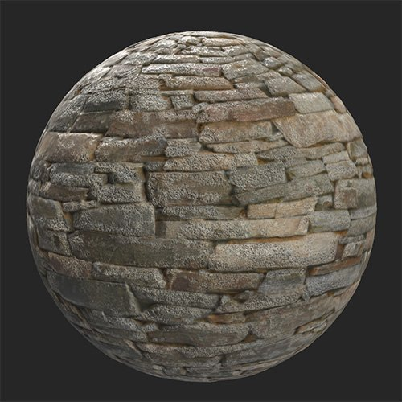

# 에로드

<table>
<tr style="border: 0;">
<td width="41.60%" style="border: 0;" valign="top">

**내부:** 마모 및 완료

</td>
<td width="58.30%" style="border: 0;" valign="top">

## 설명

**침식 필터**&#x200B;를 사용하여 재질의 높은 곳에서 닳도록 하세요.

아래 이미지는 **침식 필터**&#x200B;을 사용하여 돌벽에 침식을 추가하는 방법을 보여 줍니다.

<table>
<tr style="border: 0;">
<td style="border: 0;" valign="top">

{width="200px"}

</td>
<td style="border: 0;" valign="top">

{width="200px"}

</td>
</tr>
</table>

</td>
</tr>
</table>

## 매개변수

**기본 매개 변수**

* **임의화**:\
  임의식은 이 필터에서 임의성을 사용하는 다른 매개 변수의 임의값을 결정합니다.
* **침식 색상**: 색상 선택\
  침식 영역의 색상을 설정합니다.
* **홈 Dust 색상**: 색상 선택\
  Dust 색상을 설정합니다.
* **석영 색상**: 색상 선택\
  침식에 의해 드러나는 석영의 색상을 설정합니다.
* **침식 영역 크기**: 0-1\
  침식 효과의 확산 정도를 수정합니다.
* **침식 거칠음**: 0-0.63\
  침식의 결과로 재료의 거칠기를 변경합니다.
* **침식 강도**: 0-1\
  침식 효과의 강도를 조정합니다.
* **비 효과 강도**: 0-1
* **홈**: 0-1
* **홈 Dust 강도**: 0-1
* **홈 Scratches 강도**: 0-1\
  수직 및 Height 맵에 대한 홈의 영향을 조정합니다.
* **마이크로 그레인 밀도**: 0-1\
  그루브 스크래치의 밀도를 조정합니다.
* **석영 강도**: 0-1\
  석영 영역의 가시성을 조정합니다.
* **석영 거칠음**: 0-1\
  석영의 거칠기를 조정합니다.
* **석영 표준 변형**: 0-1\
  석영 영역의 표준을 수정합니다.
* **사용자 지정 마스크 사용**: 전환\
  사용자 정의 마스크 사용을 활성화하거나 비활성화합니다. 활성화하면 다음 매개변수가 나타납니다.
  * **마스크**: 이미지/브러시\
    마스크로 사용할 이미지를 선택하거나 브러시를 사용하여 2D 보기에서 직접 사용자 정의 마스크를 칠합니다.
  * **사용자 지정 마스크 - 흐림 효과**: 0-1\
    마스크를 흐리게 합니다.
  * **사용자 지정 마스크 - 반전**: 전환\
    마스크를 반전합니다.
  * **사용자 지정 마스크 - 불투명도**: 0-1\
    사용자 정의 마스크의 강도를 조정합니다.
