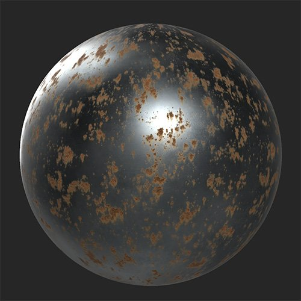

# 녹

<table>
<tr style="border: 0;">
<td width="41.60%" style="border: 0;" valign="top">

**내부:** 마모 및 완료

</td>
<td width="58.30%" style="border: 0;" valign="top">

## 설명

**녹 필터**&#x200B;를 사용하여 산화된 금속 레이어를 재질에 추가합니다.

아래 이미지에서는 **녹 필터**&#x200B;를 추가하기 전후에 금속 재질을 볼 수 있습니다.

{width="200px"}

</td>
</tr>
</table>

## 매개변수

**기본 매개 변수**

* **임의화**:\
  임의식은 이 필터에서 임의성을 사용하는 다른 매개 변수의 임의값을 결정합니다.
* **녹 스프레드**: 0-1\
  스프레드 또는 녹 양을 제어합니다.
* **가장자리 영향**: 0-1\
  곡률 맵을 기준으로 녹이 모서리와 상호 작용하는 방식을 조정합니다.
* **스프레드 Smoothness**: 0-1\
  녹이 슨 영역을 더 흐리게 하거나 낮추어 더 디테일하게 만듭니다.
* **금속에만 영향**: 토글\
  활성화되면 **녹 필터**&#x200B;는 금속 값이 0보다 큰 영역에만 영향을 줍니다.

**녹**

* **녹 모양**:\
  녹의 기반이 되는 패턴을 변경합니다.
* **녹 강도**: 0-1\
  녹 효과의 강도를 수정합니다. 이 값을 높이면 녹이 더 오래되고 강하게 나타납니다.

**껍질**

* **껍질 크기**: 0-1\
  박리 녹의 비율을 변경합니다.
* **정상 강도 제거**: 0-1\
  껍질 표준의 가시성을 조정합니다.
* **필 Height 강도**: 0-1\
  Height 맵에서 껍질의 영향을 조정합니다.

**드립**

* **드립 강도**: 0-1\
  드립 효과의 강도를 변경합니다.
* **드립스 방향**: 0-1\
  물방울 방향을 중력이나 바람과 일치하게 조정합니다.
* **물방울 길이**: 0-1\
  드롭이 소스에서 얼마나 확장되는지 조정합니다.

**마스크**

* **마스크 사용**: 전환\
  사용자 정의 마스크 사용을 활성화하거나 비활성화합니다. 활성화하면 다음 매개변수가 나타납니다.
  * **마스크**: 이미지/브러시\
    마스크로 사용할 이미지를 선택하거나 브러시를 사용하여 2D 보기에서 직접 사용자 정의 마스크를 칠합니다.
  * **사용자 지정 마스크 - 흐림 효과**: 0-1\
    마스크를 흐리게 합니다.
  * **사용자 지정 마스크 - 반전**: 전환\
    마스크를 반전합니다.
