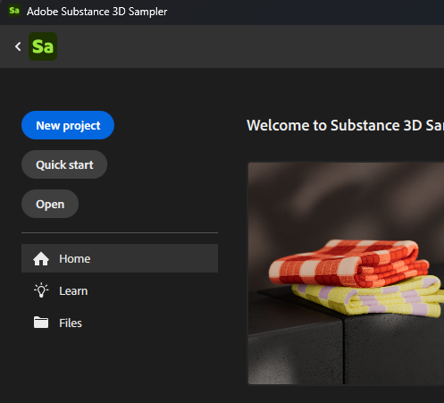

# 프로젝트 관리

Substance 3D Sampler에서는 컬렉션을 사용하여 모든 에셋 및 재질을 관리할 수 있습니다. 프로젝트는 자료를 정리하는 좋은 방법입니다. 프로젝트를 내보내거나 가져와 컴퓨터 간에 손쉽게 공유할 수 있습니다.

## 새 프로젝트 만들기

새 프로젝트를 만들려면 <b>홈 </b>화면 또는 <b>파일 > 새 프로젝트</b>에서 <b>새로 만들기</b>를 선택하세요. 새 프로젝트를 만들면 빠른 시작 대화 상자가 실행되어 빠른 작업을 선택하거나 이미지 또는 Substance 파일을 가져와 프로젝트를 시작할 수 있습니다.

또는 <b>빠른 시작</b> 단추를 사용하여 빈 프로젝트로 바로 이동할 수 있습니다. 필요에 따라 에셋 및 콘텐츠를 수동으로 가져올 수도 있습니다.

&quot;새로 만들기&quot; 단추를 클릭하면 프로젝트를 저장할 때까지 프로젝트가 자동으로 열리고 &quot;*무제 프로젝트\**&quot;이라는 이름이 지정됩니다. <b>프로젝트 패널</b>에서 강조 표시된 <b>새 에셋 버튼 </b>을(를) 사용하여 프로젝트에 에셋을 추가할 수 있습니다.

{width="600px"}

## 프로젝트 저장

프로젝트를 저장하려면 <b>파일 > </b> 저장 또는 <b>다른 이름으로 저장</b> 메뉴 동작을 사용하십시오. 그러면 프로젝트 파일을 저장할 위치와 사용할 이름을 선택할 수 있는 대화 상자가 열립니다.

또는 바로 가기 <b>Ctrl + S</b>를 사용하여 <b>저장</b> 또는 <b>Ctrl + Shift + S</b>를 사용하여 <b>다른 이름으로 저장</b>할 수 있습니다.

저장된 프로젝트는 <b>YourProject.ssa</b>(이)라는 파일로 표시됩니다. SSA는 프로젝트에 대한 정보와 프로젝트에 있을 수 있는 종속성을 저장하는 샘플 파일 형식입니다.

## 기존 프로젝트 열기

프로젝트는 다음 몇 가지 방법으로 열 수 있습니다.

* <b>홈 화면</b>에서: 최근 프로젝트 목록을 사용하여 프로젝트를 두 번 클릭하여 빠르게 엽니다.
* <b>홈 화면</b>에서 <b>열기</b>를 클릭하여 열려는 파일을 선택할 수 있는 파일 브라우저를 엽니다.
* **파일 > 프로젝트 열기** 메뉴를 통해.
