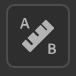

# 물리적 크기 패널

<table>
<tr style="border: 0;">
<td width="41.60%" style="border: 0;" valign="top">

</td>
<td width="58.30%" style="border: 0;" valign="top">

**물리적 크기 패널**&#x200B;을 사용하여 스캔한 샘플 및 이미지의 실제 물리적 크기를 구성합니다.

</td>
</tr>
</table>

스캔한 샘플 및 이미지의 실제 물리적 크기를 디지털 컨텍스트와 일치시켜 응용 프로그램 간에 물리적으로 정확한 비주얼을 만들 수 있습니다.\
다음 도구와 매개 변수를 사용하면 재질 물리적 크기를 정의하고 개체에 재질을 적용할 때 정확하고 사실적인 비주얼을 만들 수 있습니다.

## 실제 크기 설정

>[!NOTE]
>
> 재질의 물리적 크기를 설정하려면 이미지 가져오기 레이어가 있어야 합니다.

샘플/이미지의 물리적 크기를 계산하려면 **물리적 크기 설정**&#x200B;을 사용하도록 설정하십시오.

### 입력 이미지 크기

이 섹션에서는 샘플의 크기를 수동으로 설정할 수 있고 물리적 크기를 자동으로 계산하는 도구를 제공합니다.

**참조 레이어:** 물리적 크기가 계산된 이미지를 참조합니다.\
**너비(X):** 참조 레이어의 실제 너비를 설정합니다\
**Height(y):** 참조 레이어의 실제 Height 설정\
**도구:**

측정 진단을 사용하면 이미지의 두 포인트 사이의 거리를 측정할 수 있습니다(참고용으로만 사용).

자동 측정 도구를 사용하면 이미지 메타데이터(dpi)를 기반으로 샘플의 예상 실제 크기를 얻을 수 있습니다. 이 방법은 스캔한 샘플에서만 정확합니다.

측정 도구를 사용하면 샘플의 두 피쳐 사이의 물리적 거리를 지정하여 물리적 크기를 교정할 수 있습니다. 일반적으로 이 방법이 샘플의 물리적 크기를 계산하는 데 가장 좋은 방법입니다.

### 3D 메시 표면

이러한 도구를 사용하면 재질 표면의 종횡비를 설정할 수 있습니다.

**실제 크기 조절:** 실제 크기를 설정하거나 해제합니다. 물리적 스케일은 세 축을 따라 메쉬의 둘레입니다.\
물리적 값으로 재질을 조정합니다. Height(Y) 및 깊이(Z)의 폭(X)을 조작하는 중입니다.\
**텍스처 타일링:** 재질의 타일링을 설정합니다

### 출력 자료

재료의 실제 출력을 시각화하는 데 도움이 됩니다.

**실제 비율로 표시:**\
2D 뷰포트의 디스플레이는 실제 비율을 준수합니다.\
**Height 비율:** 실제 비율을 기준으로 3D 뷰포트에서 설정/계산됩니다.
