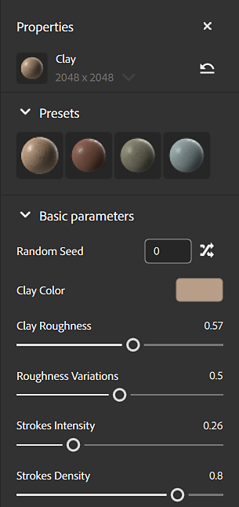

# 속성 패널

**속성 패널**&#x200B;에는 **레이어 패널**&#x200B;에서 선택한 레이어의 매개 변수와 속성이 표시됩니다. 매개 변수를 사용한 작업을 가장 잘 확인하는 방법은 해당 매개 변수를 사용하여 에셋에 미치는 영향을 확인하는 것입니다.

**속성 패널**&#x200B;에 나타나는 매개 변수는 **레이어 패널**&#x200B;에서 선택한 항목에 따라 다릅니다. 한 레이어에 둘 이상의 사용자 정의 속성 세트가 있을 수 있습니다. 예를 들어 스택의 맨 아래에 없는 재질 레이어에는 블렌드 속성이 있습니다. 레이어 스택의 각 아이콘은 서로 다른 속성 및 매개 변수 세트입니다. 재질 속성과 블렌드 속성이 모두 있는 재질 레이어의 경우 해당 레이어에는 두 개의 아이콘이 있습니다.

<table>
<tr style="border: 0;">
<td style="border: 0; width: 30%" valign="top">

</td>
<td style="border: 0;" valign="top">

**레이어 패널**&#x200B;의 이 이미지에서 레이어 스택의 각 아이콘에는 재질의 모양을 제어하는 서로 다른 매개 변수 집합이 있습니다. 예를 들어 클레이 레이어에는 재질 아이콘과 블렌드 아이콘이 모두 있으며, 이들 아이콘 각각에는 별도의 매개 변수가 있습니다. [롤 페인트] 레이어에도 [재질] 아이콘과 [혼합] 아이콘이 모두 있지만 이 레이어는 호버 상태이므로 가시성 전환도 있습니다.

</td>
</tr>
</table>

## 적용 대상...

**속성 패널**&#x200B;의 **적용 대상** 섹션을 사용하면 현재 레이어가 영향을 받는 채널을 제어할 수 있습니다. 다른 속성과 마찬가지로 채널 설정도 레이어 또는 혼합 선택 여부에 따라 달라집니다.

![속성 채널의 [적용 대상...] 섹션을 사용하면 현재 필터에 영향을 주는 채널을 제어할 수 있습니다.](../../assets/6.0_AppliedTo.png)

기본적으로 대부분의 재질과 필터에는 모든 채널이 켜져 있습니다. [명도] 또는 [생동감] 같은 일부 필터는 단일 채널에만 영향을 줍니다. 필터가 단일 채널에만 영향을 주는 경우 레이어 이름 옆에 영향을 받는 채널이 표시됩니다.

