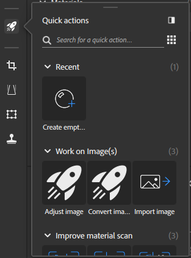
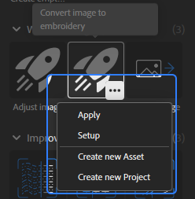

# 빠른 작업 패널

[빠른 작업](../../features-and-workflows/quick-actions.md)은 몇 번의 클릭만으로 강력한 작업을 수행할 수 있는 기능 및 작업 과정의 컬렉션입니다. 빠른 작업을 사용하여 재질을 만들거나 프로젝트를 만들거나 기존 스택에 필요한 레이어를 추가합니다.

빠른 작업 패널에서 빠른 작업을 클릭하여 스택에 추가하거나 빠른 작업 유형에 따라 새 에셋을 만듭니다. 빠른 작업은 다음 범주로 나뉩니다.

* **최근**: 가장 최근에 사용한 빠른 작업에 액세스합니다.
* **이미지 작업**: 이미지 가져오기, 변환 또는 조정.
* **재질 스캔 개선**: 스캔한 재질을 정렬하거나 다듬거나 바둑판식으로 배열하여 더 나은 결과를 얻을 수 있습니다.
* **이미지에서 재질 만들기**: 필요한 레이어를 레이어 스택에 추가하여 하나 이상의 이미지를 재질로 변환합니다.
* **처음부터 재질 만들기**: 시작 레이어로 새 재질 에셋을 만듭니다.

빠른 작업 위에 마우스를 가져가면 다음과 같은 옵션 버튼을 사용할 수 있습니다.

* 레이어 스택에 빠른 작업을 **적용**&#x200B;합니다.
* 대화 상자를 통해 빠른 작업을 **설정**.
* 선택한 빠른 작업을 사용하여 **새 에셋을 만듭니다**.
* 선택한 빠른 작업을 사용하여 **새 프로젝트를 만듭니다**.

