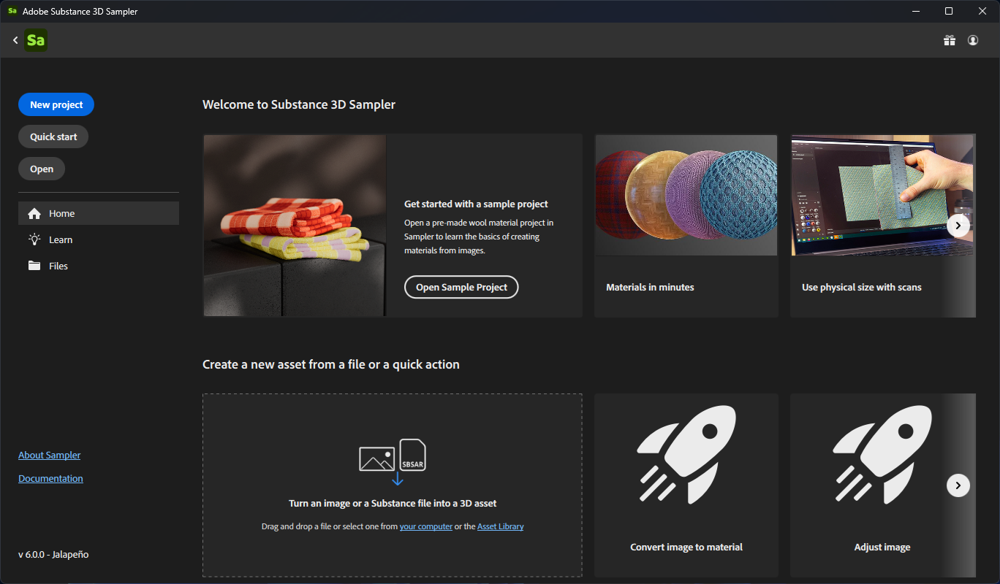

# 홈 화면

Sampler을 열면 <b>홈 화면</b>이 나타납니다. <b>홈 화면</b>에는 새 프로젝트 또는 기존 Sampler 프로젝트를 시작하는 데 도움이 되는 다양한 옵션이 있습니다.

1. <b>새 프로젝트</b>: 파일을 가져오고 빠른 작업 컬렉션에서 선택하여 새 프로젝트를 만듭니다.
1. <b>빠른 시작</b>: 새 프로젝트를 만들고 재질 사전 설정을 선택합니다.
1. <b>열기</b>: 시스템의 파일 브라우저에서 프로젝트를 엽니다.
1. <b>홈</b>: 권장 자습서에 액세스하거나, 새 프로젝트를 만들거나, 최근 프로젝트 목록을 봅니다.
1. <b>학습</b>: Sampler의 비디오 튜토리얼 및 학습 콘텐츠에 액세스합니다.
1. <b>파일</b>: 최근에 연 프로젝트 목록을 봅니다.
1. <b>Sampler 정보</b>: 사용 중인 3D Sampler 버전에 대해 자세히 알아보세요.
1. <b>설명서</b>: 설명서를 보고 능력을 확장하세요.

새 프로젝트를 열거나 시작하면 <b>홈 화면</b>이 사라지므로 에셋 만들기를 시작할 수 있습니다. <b>파일 메뉴</b>에서 <b>홈 화면</b>을 다시 열 수 있습니다.
