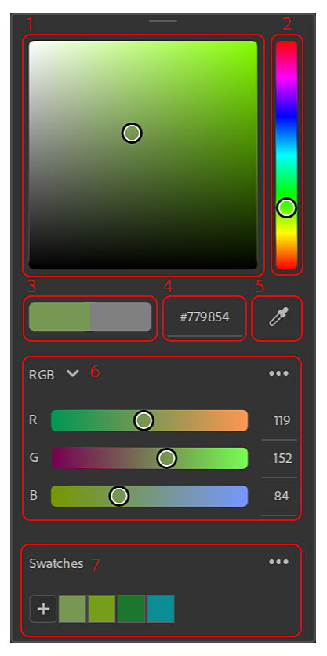

# 색상 피커

색상을 선택해야 할 때마다 [색상 피커]가 표시됩니다.

## UI 개요

{width="300px"}

1. **색상 사각형**: 선택한 색조로 채도와 색상의 밝기를 조정합니다.
1. **색조 슬라이더**: 색상의 색조를 조정합니다.
1. **현재/이전**: 왼쪽 색상은 색상 피커의 현재 색상입니다. 올바른 색상은 색상 피커를 열 때 사용했던 색상입니다. 현재 색상을 원래 값으로 재설정하려면 오른쪽 색상을 클릭합니다.
1. **16진수 입력**: 원하는 색상의 16진수 색상 코드를 직접 입력할 수 있습니다.
1. **스포이드**: 스포이드를 실행하여 화면에서 색상을 선택합니다. 커서 옆에 풍선이 나타나 선택할 색상을 미리 봅니다.
1. **슬라이더**: 다른 색상 공간(RGB 또는 HSV)을 사용하여 색상을 조정합니다.
1. **색상 견본**: 나중에 사용할 수 있도록 색상을 저장하여 빠르게 액세스합니다.

### 슬라이더

#### 색상 공간

RGB(빨강, 녹색, 파랑)와 HSV(색조, 채도, 값)는 사용 가능한 두 색상 공간입니다.

{width="200px"}

#### 슬라이더 옵션

{width="200px"}

**슬라이더 표시**

이 옵션을 사용하면 슬라이더를 숨겨 공간을 절약할 수 있습니다. 슬라이더가 숨겨진 경우에도 값 입력을 수정할 수 있습니다.

**부동 소수점 값**

{width="200px"}

슬라이더에 부동 소수점 또는 정수 값을 사용할지 여부를 전환합니다. 부동 소수점 값은 0에서 1 사이이고 정수 값은 0에서 255 사이입니다.

**동적 슬라이더**

값이 변경될 때 슬라이더 배경이 동적으로 업데이트되는지 여부를 전환합니다. 아래 이미지는 동적 슬라이더가 꺼진 경우 슬라이더 모양을 보여줍니다.

{width="200px"}

### 색상 견본

색상 견본은 응용 프로그램이나 여러 프로젝트에서 사용할 특정 색상을 저장하려는 경우 유용합니다.

색상 견본은 Sampler에 대한 전역적이며 프로젝트별로 고유하지 않습니다.

&quot;+&quot; 버튼을 클릭하면 현재 색상이 있는 색상 견본이 목록의 첫 번째 견본에 추가됩니다.

{width="200px"}

참고: 같은 색상의 색상 견본은 두 번 추가할 수 없습니다. 이미 저장된 색상 견본은 다시 추가하려고 하면 강조 표시됩니다.

견본에 마우스를 가져가면 색상 값이 16진수로 표시된 툴팁이 표시됩니다.

#### 색상 견본 옵션

모두 삭제 옵션.

{width="200px"}

색상 견본을 마우스 오른쪽 버튼으로 클릭하여 삭제하거나 현재 색상으로 바꿉니다.

{width="200px"}

견본을 색상 피커 밖으로 드래그하여 놓아 삭제할 수도 있습니다.
