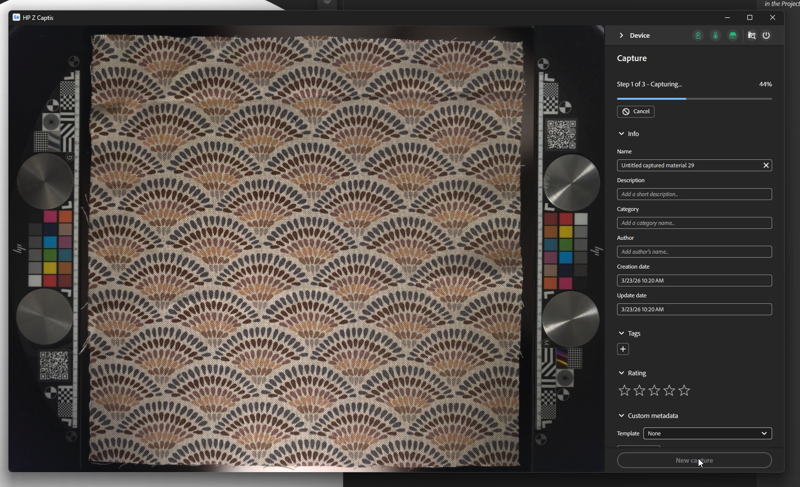

# Sampler을 실행하고 HP Z Captis를 켭니다

Sampler이 실행되고 HP Z Captis 디바이스가 컴퓨터에 연결된 경우 왼쪽 막대의 Captis/cone 아이콘을 클릭합니다.

UI에 HP Z Captis가 표시되지 않으면 FAQ를 참조하십시오.

HP Z Captis를 클릭하면 3가지 옵션이 있는 전용 창이 열립니다.

1. <b>콘텐츠 찾아보기</b>: 파일 탐색기를 열어 HP Z Captis 장치의 로컬 저장소를 찾습니다.
1. <b>검색 시작</b>: HP Z Captis 장치를 초기화하고 캡처 흐름을 시작합니다.
1. <b>종료</b>: 장치를 종료하고 창을 닫습니다.

## HP Z Captis 창 닫기

HP Z Captis 창을 닫으면 언제든지 <b>프로세스를 계속할지</b> 아니면 <b>중단</b>할지 묻는 메시지가 표시됩니다.

[계속]을 선택하면 장치는 현재 작업을 오프라인으로 진행하고 현재 단계가 끝나면 일시 중지합니다. 나중에 Sampler을 다시 연결하여 캡처 세션의 다음 단계를 계속할 수 있습니다.

## 미리 보기 단계

Sampler에서 HP Z Captis 디바이스의 미리보기가 초기화됩니다. <b>처음 시작하는 동안에는 </b> 보기와 상호 작용하지 않는 것이 좋습니다.

이번 새 업데이트에는 자동 및 수동 두 가지 모드가 있습니다.

### 일반 설정

#### 자동 모드

이제 한 번의 클릭으로 캡처를 시작할 수 있습니다. Sampler은 다음을 수행합니다.

* 기본 이름을 정의합니다.
* 역광을 사용하여 자동으로 관심 영역(ROI)/자르기 영역을 정의합니다.
* 전체 ROI에 초점을 맞추십시오.
* 강도 설정을 재질에 맞게 변경합니다.

이전에 캡처를 수행한 경우 선택한 재질 범주, 출력 및 캡처 해상도는 이전 캡처와 동일합니다.

#### 수동 모드

직접 일부 설정을 정의할 수도 있습니다.

*프로젝트 이름*

캡처의 프로젝트 이름을 정의하고 검색할 출력 유형을 정의할 수 있습니다.

*출력*

* 기본적으로 재질 PBR 채널(기본 색상, 표준, Height 및 불투명도)만 저장됩니다.\
  LDR(낮은 동적 범위)과 HDR(High Dynamic Range) 중에서 출력 유형을 선택할 수 있습니다.

*캡처 해상도*

* 239px/in - 94px/cm(미리 보기: 더 낮은 품질, 더 빠른 스캔)
* px/in - 142px/cm(기본값: 고품질, 대부분의 작업 과정에서 쉽게 관리 가능 - 30x30cm 캡처의 경우 4k에 해당)
* 718px/in - 284px/cm(전체 해상도 - 30x30cm 캡처의 경우 8k에 해당)

Captis 및 Sampler 워크플로에서 
참고: Sampler에서는 PBR 채널만 로드됩니다.\
기본 설정에 저장된 기본 폴더 캡처를 수정할 수 있습니다.

<b>재질 범주</b>

이 설정을 특정 재질에 맞게 미세 조정된 지도 생성을 위해 스캔하는 재질 유형으로 설정합니다.\
선택된 기본 범주는 &quot;Fabric&quot;입니다. 거칠음 채널의 결과를 최적화하는 데 도움이 됩니다.

스캔하는 내용에 여러 유형의 자료가 포함된 경우 가장 큰 자료의 범주를 선택하십시오.

<b>자르기</b>

자르기는 자동 또는 수동으로 수행할 수 있습니다.

자동 자르기는 역광을 사용하여 재료의 윤곽선을 정의하고 주변에 관심 영역(ROI)를 배치합니다. 여러 재질 샘플을 한 번에 디지털화하거나 재질이 매우 투명할 때는 적응하지 못한다.
이 경우 미리 보기에서 자르기 위젯의 모퉁이를 드래그하거나 정의된 해상도 또는 물리적 크기를 설정하여 ROI를 정의할 수 있습니다.

<b>카메라 설정 </b>

* 강도: 카메라 노출을 조정합니다.\
  [자동]을 클릭하면 ROI의 중앙을 사용하여 재질에 가장 적합한 강도를 정의합니다.

* 초점: 카메라 초점을 조정합니다.\
  자동을 클릭하면 전체 ROI를 통해 이상적인 초점을 정의할 수 있습니다.
  더 이상 하나의 지점에 초점을 맞추지 않는 이 새로운 초점 알고리즘은 디지털화된 자료에 더 균일한 초점을 맞출 수 있도록 하여, 더 높은 품질의 스캔을 유도하고 이를 통해 타일링이 더 쉬워집니다.

원하신다면 두 가지를 모두 수작업으로 정하실 수 있습니다

<b>기타 설정</b>

다른 유형의 설정<b>은 </b>에만 수정해야 합니다. 색상 및 정렬 보정

* 색 보정

HP Z Captis 기술 영역 덕분에 기본 색상 맵의 색상을 보정합니다. \
그러면 최종 재료가 HP Z Captis 트레이에 추가한 샘플과 동일한 색상이 됩니다.\
색상 견본이 있는 기술 영역은 자동으로 감지되어 교정에 사용됩니다. 그들은 샘플의 각각의 면에 있는 그들의 특정한 공간에 배치되어야 합니다.

이는 Studio 모드에서만 사용할 수 있습니다. 이 색상 교정하기 전에 초점을 맞추세요.

이 보정은 <b>몇 개월마다</b> 수행해야 합니다. 모든 스캔 또는 디바이스를 사용할 때마다 이를 수행할 필요는 없습니다.

* 정렬 보정

<b>장치를 처음 설정할 때</b> <b>이 맞춤을 </b> 수행해야 합니다. 이 맞춤은 물리적으로 이동할 때마다 다음 두 달마다 수행해야 합니다. 모든 캡처</b>에 대해 이 프로세스를 <b>하는 것은 <b>필요하지 않습니다</b>.

이 정렬 보정을 시작하기 전에 초점을 맞추십시오.

정렬을 수행하려면 캡처 공간의 중앙에 인쇄되는 텍스트가 있는 종이와 같이 선명하고 명확한 정보가 포함된 개체를 <b>배치하십시오</b>. 서랍을 닫고 정렬 버튼을 클릭하십시오. 이 작업이 완료되면 모든 것이 적소에 있는지 확인할 수 있습니다. 기술 영역은 스캔 공간의 양쪽에 위치되며, 소재는 중앙에 위치되며, 필요한 경우 HP Z Captis 장치와 함께 제공된 자석을 사용하여 제자리에 고정되며, 소재 스캔을 시작할 수 있습니다.

설정이 모두 완료되면 <b>검사를 시작합니다</b>.

## 캡처, 처리 및 복사 단계

스캔이 시작되면 미리보기에 프로세스 중에 촬영한 사진이 표시됩니다.

처리 부품은 다음 세 부분으로 분할됩니다.

* <b>캡처</b>: 모든 필수 사진 촬영

* <b>처리</b>: 사진을 처리하여 PBR 채널을 생성합니다(기본 색상, 표준, Height, 불투명도).

* <b>복사</b>: HP Z Captis 장치의 결과를 컴퓨터로 복사 중

캡처 및 처리하는 동안 메타데이터(Sampler 메타데이터 패널에서 찾을 수 있는 것과 동일한 메타데이터)를 추가할 수 있습니다.

처리하는 동안 결과가 타일로 작성되어 표시됩니다.

## 요약 단계

이 단계에서 스캔 결과를 검토할 수 있습니다. 만들어진 모든 채널이 표시됩니다. 탐색기 모드에서는 탐색기 링에 백라이트가 없으므로 불투명도가 만들어지지 않습니다.

재질을 Sampler으로 보내고 프로젝트에 추가한 다음 처리를 시작할 수 있습니다.
프로젝트에 새 캡처를 추가하지 않고 바로 시작할 수도 있습니다.
두 경우 모두 컴퓨터의 해당 폴더에서 스캔한 맵을 찾을 수 있습니다. C:\Users\username\Documents\Adobe\Adobe Substance 3D Sampler\Captis\Material

## 자료 편집

HP Z Captis 창을 종료하면 채널(관련된 경우 기본 색상, 표준, Height, 거칠기 및 불투명도)이 [레이어] 패널에 레이어로 추가됩니다.

Sampler 필터(균일화, 원근 자르기, 타일링 등)를 사용하여 재질을 처리하고 청소합니다.

작업을 완료하면 다음을 수행할 수 있습니다.

* Sampler 프로젝트 저장: 파일 > 다른 이름으로 저장 ... (Ctrl + S)

* 재질 내보내기: 파일 > 내보내기 ... (Ctrl + E)

