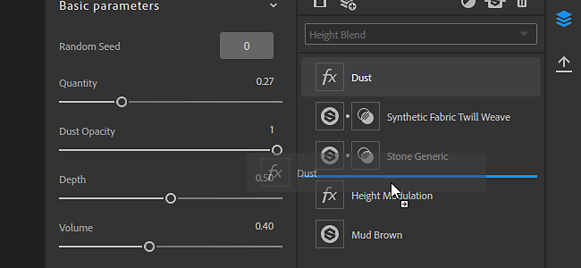
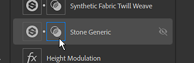
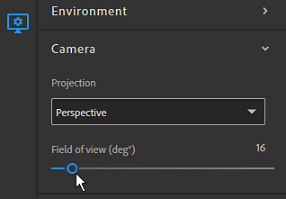

# 버전 2019.1

**Substance Alchemist 2019.1 &quot;참깨&quot;**&#x200B;를 사용하면 새 프로젝트 관리자와 에셋을 공유할 수 있습니다. 작업 과정을 개선하기 위해 레이어 스택을 완전히 다시 빌드했습니다. 추가 컨트롤 및 정보가 뷰포트에 추가되었습니다. 새로운 버전의 딜라이터는 재료의 품질과 정확도를 향상시킵니다.

출시일: *2019년 11월*

>[!NOTE]
>
> **참고:** Beta 버전 0.8.1 이하에서 제작된 콘텐츠는 버전 2019.1과 호환되지 않습니다. 그러나 아무것도 손실되지 않고 이 데이터는 버전 0.8.1을 실행하여 계속 액세스할 수 있습니다.

## 주요 기능

### 새 시작 화면

이제 Substance Alchemist에 최신 프로젝트로 빠르게 이동할 수 있는 시작 화면이 표시되지만 새 프로젝트를 만들 수도 있습니다. 시작 화면에는 [Substance 아카데미](https://academy.substance3d.com/)와 같은 기존 플랫폼에 대한 몇 가지 링크도 제공됩니다.

### 프로젝트 관리

버전 2019.1에서는 재료 컬렉션을 수집할 수 있는 프로젝트의 개념을 소개합니다. 프로젝트를 내보내 다른 컴퓨터에 공유할 수도 있습니다.

프로젝트에 대한 자세한 내용은 [프로젝트 관리](../../getting-started/project-management.md)를 참조하세요.

### 뉴딜라이터

사진에서 어두운 영역을 제거하는 데 사용되는 기쁨이 향상되었습니다. 이제 다양한 표면의 세부 묘사와 원본 색상을 유지하므로 생성된 재료의 정확도가 향상됩니다.

### 새 레이어 스택

레이어 스택의 가능성과 작업을 확장하기 위해 레이어 스택을 처음부터 다시 빌드했습니다. 주목할 만한 변경 사항은 다음과 같습니다.

* **이제 전용 아이콘을 통해 재질 및 마스크에 직접 액세스할 수 있습니다**\
  레이어 스택에 재질을 추가하면 새로운 마스크 아이콘이 나타납니다. 두 번째 아이콘을 클릭하면 재료의 혼합 매개변수가 표시됩니다.

  
* **혼합 모드를 도구 모음에서 직접 변경할 수 있습니다.**\
  이제부터는 재질 레이어를 선택하면 마스크를 클릭할 필요 없이 레이어 스택 도구 모음에서 바로 혼합 모드를 변경할 수 있습니다.

  
* **특정 스캔 입력에 비트맵 할당**\
  스캔에서 재질을 만들기 위해 비트맵을 가져올 때 비트맵별로 적절한 사용을 할당할 수 있습니다.

  

### 뷰포트 개선 사항

뷰포트에 몇 가지 새로운 기능이 추가되어 사용이 개선되었습니다. 이러한 새 설정은 [뷰어 설정 패널](https://helpx.adobe.com/kr/substance-3d/unlisted/documentation/sadoc/viewer-settings-188973164.html)에서 액세스할 수 있습니다.

* **카메라 모드**\
  카메라 투영 모드를 통해 원근감과 직교 중에서 선택할 수 있습니다.

  
* **카메라 시야**\
  이제 뷰포트의 카메라 FOV(시야)를 변경할 수 있습니다. 이 값을 조정하면 재질을 사실적으로 시각화하는 데 도움이 됩니다. [시야는 원근감 투영] 모드에 있는 경우에만 제어할 수 있습니다.

  
* **채널당 해상도 및 비트 심도**\
  이제 2D 보기에 각 채널의 텍스처 해상도와 비트 심도가 표시됩니다.

  

## 릴리스 정보

### 2019.1.4 참깨

*(2020년 1월 30일 릴리스)*

**추가됨:**

* [Resources] 리소스 폴더를 비울 때 확인 프롬프트

**고정:**

* [레이어] 레이어를 두 개 이상의 아래 또는 위의 레이어로 이동
* [생성] 충분한 VRAM 예산을 할당하여 성능 향상

**알려진 문제:**

* 많은 리소스를 가져오면 Substance Alchemist 속도가 느려질 수 있습니다
* 내용 인식 채우기 필터의 고해상도는 느립니다
* 하나의 재질에 여러 개의 흐림 효과를 사용하는 것은 권장되지 않습니다
* 구형 NVIDIA 드라이버에서 Delighter 충돌(400.x 미만)
* 슬라이더에서 특정 값을 입력할 때 혼수 또는 점을 무시할 수 있습니다
* Height에 표준 필터가 MacOS에서 충돌할 수 있음

### 2019.1.3 참깨

*(2020년 1월 28일 릴리스)*

**추가됨:**

* [작업 과정] 여러 작업 과정 지원
* [작업 과정] PBR Specular 광택 작업 과정 지원
* [작업 과정] 새 채널 설정 패널
* [작업 과정] 프로젝트 생성 시 작업 과정 선택
* [채널 설정] 특정 채널 계산 활성화/비활성화
* [채널 설정] 현재 재질에서 사용할 수 있는 사용자 정의 채널 목록을 표시합니다
* [채널 설정] 필요한 경우 사용자 정의 채널을 자동으로 계산합니다.
* [채널 설정] 사용자 정의 채널의 강제/블록 계산
* [레이어] Atlas Scatter 및 스플래터 필터에서 재료 입력 자리 표시자의 새로운 UI
* [레이어] 필터의 이미지 입력 매개 변수는 레이어 아래에 제공
* [레이어] 일부 레이어가 최신 상태가 아닐 때 알림을 표시합니다.
* [레이어] 알림을 통해 오래된 레이어의 최신 버전으로 업데이트할 수 있습니다.
* [Project] 프로젝트 생성 시 새 메타데이터 필드
* [영감] 생성된 변형은 프로젝트에 따라 다릅니다.
* [2D 보기] 레이어 입력, 레이어 출력 및 재질 출력 간 전환
* [시작 화면] 가져오기 프로젝트(.alch) 옵션 추가
* [환경 설정] 캐시 위치 및 분석 개인정보 설정을 지정하는 새 환경 설정 창
* [UI] 새 UI 단추
* [성능] 병렬화 시스템의 전반적인 개선
* [성능] 재료 계산 수 최적화
* [엔진] Substance 엔진 업데이트
* [프레임워크] Qt 5.13으로 업그레이드
* [MacOS] macOS Catalina 지원의 전 세계적인 개선 사항
* [내용] 조정 필터 - 표준 강도 및 반전 매개 변수

**고정:**

* [레이어] 레이어를 삭제할 때 이미지 입력 매개 변수 설정 해제
* [레이어] 복제 패치 레이어를 추가할 때 발생하는 충돌 수정
* [레이어] 다른 레이어 스택 재질에 레이어 스택 재질을 혼합할 때 발생하는 일부 충돌 문제 수정
* [내보내기] 이제 내보낼 채널 선택이 준수됩니다.
* [리소스] 리소스 패널에서 탐색할 때 충돌이 발생하지 않습니다.
* [리소스] 손상된 Substance 파일을 가져올 때 발생하는 충돌 수정
* [리소스] 대형 폴더를 로드할 때 발생하는 충돌 수 줄이기
* [썸네일] 썸네일 계산으로 인터페이스가 고정되지 않음
* [이미지 가져오기] 애플리케이션 전체에서 이미지 유형 균일화가 지원됩니다
* [사전 설정] SBSAR에서 사전 설정을 만들 때 설명을 저장합니다
* [영감] 이미지 드래그 앤 드롭 수정
* [Application] 종료 시 충돌 수정
* [응용 프로그램] 자료를 내보낼 때 종료 시 충돌 문제 수정
* [UI] 수정 및 개선 사항
* [UI] 임시 에셋의 이름을 &quot;저장되지 않은 재질&quot;로 바꾸기
* [콘텐츠] 모든 필터의 전역 업데이트 및 정리

**알려진 문제:**

* 많은 리소스를 가져오면 Substance Alchemist 속도가 느려질 수 있습니다
* 내용 인식 채우기 필터의 고해상도는 느립니다
* 하나의 재질에 여러 개의 흐림 효과를 사용하는 것은 권장되지 않습니다
* 구형 NVIDIA 드라이버에서 Delighter 충돌(400.x 미만)
* 슬라이더에서 특정 값을 입력할 때 혼수 또는 점을 무시할 수 있습니다
* Height에 표준 필터가 MacOS에서 충돌할 수 있음

### 2019.1.2 참깨

*(2019년 12월 11일 릴리스)*

**추가됨:**

* [작업 과정] 여러 작업 과정 지원
* [작업 과정] PBR Specular 광택 작업 과정 지원
* [작업 과정] 새 채널 설정 패널
* [작업 과정] 프로젝트 생성 시 작업 과정 선택
* [채널 설정] 특정 채널 계산 활성화/비활성화
* [채널 설정] 현재 재질에서 사용할 수 있는 사용자 정의 채널 목록을 표시합니다
* [채널 설정] 필요한 경우 사용자 정의 채널을 자동으로 계산합니다.
* [채널 설정] 사용자 정의 채널의 강제/블록 계산
* [레이어] Atlas Scatter 및 스플래터 필터에서 재료 입력 자리 표시자의 새로운 UI
* [레이어] 필터의 이미지 입력 매개 변수는 레이어 아래에 제공
* [레이어] 일부 레이어가 최신 상태가 아닐 때 알림을 표시합니다.
* [레이어] 알림을 통해 오래된 레이어의 최신 버전으로 업데이트할 수 있습니다.
* [Project] 프로젝트 생성 시 새 메타데이터 필드
* [영감] 생성된 변형은 프로젝트에 따라 다릅니다.
* [2D 보기] 레이어 입력, 레이어 출력 및 재질 출력 간 전환
* [시작 화면] 가져오기 프로젝트(.alch) 옵션 추가
* [환경 설정] 캐시 위치 및 분석 개인정보 설정을 지정하는 새 환경 설정 창
* [UI] 새 UI 단추
* [성능] 병렬화 시스템의 전반적인 개선
* [성능] 재료 계산 수 최적화
* [엔진] Substance 엔진 업데이트
* [프레임워크] Qt 5.13으로 업그레이드
* [MacOS] macOS Catalina 지원의 전 세계적인 개선 사항
* [내용] 조정 필터 - 표준 강도 및 반전 매개 변수

**고정:**

* [레이어] 레이어를 삭제할 때 이미지 입력 매개 변수 설정 해제
* [레이어] 복제 패치 레이어를 추가할 때 발생하는 충돌 수정
* [레이어] 다른 레이어 스택 재질에 레이어 스택 재질을 혼합할 때 발생하는 일부 충돌 문제 수정
* [내보내기] 이제 내보낼 채널 선택이 준수됩니다.
* [리소스] 리소스 패널에서 탐색할 때 충돌이 발생하지 않습니다.
* [리소스] 손상된 Substance 파일을 가져올 때 발생하는 충돌 수정
* [리소스] 대형 폴더를 로드할 때 발생하는 충돌 수 줄이기
* [썸네일] 썸네일 계산으로 인터페이스가 고정되지 않음
* [이미지 가져오기] 애플리케이션 전체에서 이미지 유형 균일화가 지원됩니다
* [사전 설정] SBSAR에서 사전 설정을 만들 때 설명을 저장합니다
* [영감] 이미지 드래그 앤 드롭 수정
* [Application] 종료 시 충돌 수정
* [응용 프로그램] 자료를 내보낼 때 종료 시 충돌 문제 수정
* [UI] 수정 및 개선 사항
* [UI] 임시 에셋의 이름을 &quot;저장되지 않은 재질&quot;로 바꾸기
* [콘텐츠] 모든 필터의 전역 업데이트 및 정리

**알려진 문제:**

* 많은 리소스를 가져오면 Substance Alchemist 속도가 느려질 수 있습니다
* 내용 인식 채우기 필터의 고해상도는 느립니다
* 하나의 재질에 여러 개의 흐림 효과를 사용하는 것은 권장되지 않습니다
* 구형 NVIDIA 드라이버에서 Delighter 충돌(400.x 미만)
* 슬라이더에서 특정 값을 입력할 때 혼수 또는 점을 무시할 수 있습니다
* Height에 표준 필터가 MacOS에서 충돌할 수 있음

### 2019.1.1 참깨

*(2019년 11월 26일 릴리스)*

**추가됨:**

* [혼합] 새로운 불투명도 혼합 모드
* [엔진] 새 Substance 엔진 버전

**고정:**

* [레이어] 아직 계산 중인 레이어를 삭제하는 동안 충돌 수정
* [레이어] 아래 레이어를 제거하는 동안 충돌 수정
* [레이어] 재질 이름에 특수 문자가 포함된 경우 충돌 수정
* [레이어] 위젯을 사용하는 모든 필터의 계산 중지
* [레이어] 복제 패치 및 [내용 인식 채우기] 필터를 사용하는 동안 충돌 방지
* [레이어] 스플래터 입력 슬롯에서 필터를 드래그하여 드롭하는 동안 발생하는 충돌 문제 해결
* [Resources] 로컬 폴더를 연결하거나 Substance Alchemist에서 리소스를 가져오는 동안 충돌 해결
* [컬렉션] 재질 간에 빠르게 전환하는 동안 충돌 문제 해결
* [UI] 뷰포트의 타일링, 변위 슬라이더에서 값이 null이거나 유효하지 않은 동안 충돌 수정
* [영감] 영감 탭에 액세스하는 동안 충돌 수정
* [영감] 방금 저장한 레이어 스택 재질에 영감을 주는 동안 충돌 수정
* [성능] 대용량 Substance 재질 및 필터(타일링) 계산 속도 향상
* [도움말] 내보내기 로그 파일 수정
* [콘텐츠] 임의화 필터는 모든 채널에서 작동합니다.
* [콘텐츠] 다중 각도 작업 과정은 모든 스캔을 고려합니다.
* [내용] AO 혼합 교정 혼합
* [내용] 곡률 혼합 올바른 혼합
* [내용] 색상 ID를 혼합하면 올바른 혼합이 됩니다
* [내용] 사용자 정의 마스크 혼합 올바른 혼합
* [내용] 거칠기 수정을 위한 조정 필터 수정
* [콘텐츠] 사용자 정의 일반 채널 업로드를 위한 기본 재질 필터 수정
* [내용] 엠보싱 필터의 사용자 정의 가져오기 패턴 수정

**알려진 문제:**

* 하나의 재질에 여러 개의 흐림 효과를 사용하는 것은 권장되지 않습니다
* 구형 NVIDIA 드라이버에서 Delighter 충돌(400.x 미만)
* 슬라이더에서 특정 값을 입력할 때 혼수 또는 점을 무시할 수 있습니다
* Height에 표준 필터가 MacOS에서 충돌할 수 있음

### 참깨

*(2019년 11월 4일 릴리스)*

**추가됨:**

* [프로젝트] 프로젝트 생성
* [Project] 프로젝트 데이터가 포함된 .alch 파일 형식 소개
* [프로젝트] 컬렉션 및 해당 재질이 포함된 .alch 프로젝트를 내보냅니다
* [Project] .alch 프로젝트 가져오기
* [Project] 최근 프로젝트 열기
* [시작 화면] 시작 시 시작 화면이 표시됩니다
* [시작 화면] 시작 화면에서 프로젝트를 만듭니다.
* [시작 화면] 시작 화면에서 모든 프로젝트 목록에 액세스
* [시작 화면] 설명서, 정보 팝업 및 라이선스 관리에 액세스하는 빠른 링크
* [File Menu] 파일 메뉴 통합
* [파일 메뉴] [파일] 탭의 프로젝트 명령에 액세스하여 레이어 스택의 저장
* [파일 메뉴] 편집 탭에서 실행 취소 및 재실행 명령에 액세스합니다.
* [파일 메뉴] 도움말 탭 아래의 파일 메뉴에서 이전 도움말 메뉴가 이동되었습니다.
* [Layers] 레이어 스택의 새로운 아키텍처
* [레이어] 레이어 스택의 새 UI
* [레이어] 도구 모음에서 직접 혼합 모드를 선택합니다
* [레이어] 블렌드 매개변수와 재료 매개변수에 개별적으로 액세스
* [레이어] 레이어 스택에 있는 스플래터 필터의 전용 입력에 바로 재질을 추가합니다
* [레이어] 이미지 가져오기 레이어에서 직접 스캔 순서 변경
* [뷰포트] 카메라 시야각 제어
* [뷰포트] 직교 또는 원근 카메라 간 전환 가능
* [뷰포트] 각 채널의 비트 심도 및 해상도 정보 표시
* [Resources] 기본 재질은 기본적으로 열려 있습니다.
* [Cache] 축소판 캐시 폴더를 찾습니다.
* [Cache] 렌더링 캐시 폴더를 찾습니다.
* [패널] 재질 설정 패널이 일시적으로 숨겨집니다.
* [작업 과정] Specular/광택이 일시적으로 비활성화됨
* [MacOS] Catalina OS 버전 공증
* [콘텐츠] Delighter 필터의 새 버전
* [콘텐츠] 새로운 이미지 내용 인식 채우기 필터
* [내용] 새 재질 내용 인식 채우기 필터
* [Content] 변형 필터에 안전한 변형 옵션이 있음

**고정:**

* 새로운 UI 및 아키텍처 릴리스에서는 생성과 관련된 이전의 모든 버그가 현재 유효하지 않습니다.
* 툴팁이 상단 표시줄의 아이콘을 숨기지 않음 (3D, 2D, 2D/3D)
* [Content] 스플래터 필터는 전체 Height 맵이 있는 Atlas를 허용합니다
* [콘텐츠] 변환 필터는 이미지(scan1, scan2,...)에서 작동합니다.

**알려진 문제:**

* 하나의 재질에 여러 개의 흐림 효과를 사용하는 것은 권장되지 않습니다
* 구형 NVIDIA 드라이버에서 Delighter 충돌(400.x 미만)
* 슬라이더에서 특정 값을 입력할 때 혼수 또는 점을 무시할 수 있습니다
* Height에 표준 필터가 MacOS에서 충돌할 수 있음

**추가됨:**

* [혼합] 새로운 불투명도 혼합 모드
* [엔진] 새 Substance 엔진 버전

**추가됨:**

* [혼합] 새로운 불투명도 혼합 모드
* [엔진] 새 Substance 엔진 버전

**추가됨:**

* [작업 과정] 여러 작업 과정 지원
