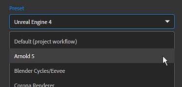

# 버전 2020.1 (2.1)

**Substance Alchemist 2020.1 &quot;Tiramisu&quot;**&#x200B;를 사용하면 렌더러 및 게임 엔진을 위해 직접 포장된 자료를 내보낼 수 있습니다. 기본적으로 Unity HDRP, Unreal Engine 4, Blender, Vray-Next 등과 같은 15개의 내보내기 사전 설정을 사용할 수 있습니다.

업데이트 검사기를 위한 새로운 구성 파일 및 제어 기능을 제공합니다.

출시일: *2020년 3월 12일*

## 주요 기능

### 새 내보내기 창

내보내기 창이 재구성되어 몇 가지 새로운 기능이 포함된 새로운 인터페이스가 도입되었습니다.

* **내보내기 사전 설정을 사용하여 특정 렌더러 또는 게임 엔진의 텍스처를 압축합니다** 이제 내보내기 프로세스 중에 특정 타사 응용 프로그램의 텍스처를 변환, 압축 및 이름을 지정하는 내보내기 사전 설정 목록 중에서 구성을 선택할 수 있습니다. 이 변환의 결과는 인터페이스 오른쪽의 채널 목록에 표시됩니다.\
  새 내보내기에는 기본적으로 다음 사전 설정이 포함됩니다.

  * 언리얼 엔진
  * 유니티 스탠다드
  * 유니티
  * 블렌더 주기/이벤트
  * 아놀드
  * Corona 렌더링
  * 엔스케이프
  * Keyshot 9
  * Redshift
  * Vray Next
  * Lens Studio
  * Spark AR Studio
  * PBR 금속 거칠기의 PBR Specular/광택

  
* **재질 이름으로 하위 폴더 만들기**\
  여러 재질을 공통 위치로 내보낼 때 이제 하위 폴더를 만들 수 있습니다
* **내보내기 설정이 저장되고 다음 내보내기와 함께 복원됨**\
  편의를 위해 내보내기 창을 다시 열면 이전에 사용한 내보내기 설정도 다시 사용됩니다. 재질을 더 쉽고 빠르게 다시 내보낼 수 있습니다.
* **사용자 지정 내보내기 사전 설정 만들기, 가져오기 및 관리**\
  사용자 정의 내보내기 사전 설정을 만들 수도 있습니다. 이러한 문서를 만들고 관리하는 방법에 대해 알아보려면 다음 문서 페이지를 살펴보십시오.

  * [사용자 정의 사전 설정 관리](https://helpx.adobe.com/kr/substance-3d/unlisted/documentation/sadoc/creating-and-importing-custom-presets-188976295.html)
  * [사전 설정 관리](../../getting-started/export/managing-presets.md)

### 응용 프로그램 구성

(사진: [Fabian Grohs](https://unsplash.com/@grohsfabian?utm_source=unsplash&utm_medium=referral&utm_content=creditCopyText), [Unsplash](https://unsplash.com/?utm_source=unsplash&utm_medium=referral&utm_content=creditCopyText))

이제 구성 파일을 사용하여 Substance Alchemist을 구성할 수 있습니다. 이렇게 하면 스튜디오와 같은 컴퓨터 간에 응용 프로그램을 보다 쉽게 설정할 수 있습니다. 구성 파일은 기본 리소스와 연결된 폴더 목록을 정의합니다.

구성 파일을 만들고 사용하는 방법에 대한 자세한 내용은 전용 [설명서 페이지](https://helpx.adobe.com/kr/substance-3d/unlisted/documentation/sadoc/resources-configuration-file-188976187.html)를 참조하십시오.

### 기타 개선 사항

이번 릴리스에서는 몇 가지 새로운 워크플로우 개선 사항을 사용할 수 있습니다.

* **2D 보기의 초점**\
  이제 &quot;F&quot; 단축키를 사용하여 3D 뷰와 마찬가지로 2D 뷰를 재설정하고 가운데에 배치할 수 있습니다.
* **마지막 프로젝트 다시 열기**\
  더 쉽고 빠르게 콘텐츠를 만들 수 있도록 애플리케이션은 이제 마지막으로 사용한 프로젝트를 다시 엽니다. 이제 Create lab이 애플리케이션을 열 때의 기본 모드이기도 합니다.
* **검사기 구성 업데이트**\
  새 버전을 사용할 수 있는 경우 알림을 받을 것인지 정의합니다. 자세한 내용은 전용 [문서 페이지](../../technical-support/configuration/update-checker.md)를 참조하세요.

### 새 콘텐츠

몇 가지 필터를 개선하고 시작 콘텐츠도 업데이트했습니다.

* **새 시작 자료**\
  몇 가지 기존 재질을 새 재질로 교체했습니다. 다음은 새 재질 목록입니다.
  * 알칸타라 극세사
  * 양탄자 바닥
  * 클리프 록
  * 구리
  * 깨진 Dirt
  * 거칠게 주조됨
  * 테라코타
  * 울 직물
  * 직물
* **비트맵 2 재질 필터를 사용한 금속 컨트롤**\
  Bitmap 2 Material 필터가 금속 채널을 더 많이 제어할 수 있도록 업데이트되었습니다. 이제 사용자 정의 비트맵 입력을 사용하거나 균일한 색상을 정의할 수 있습니다.
* **개선된 조정 필터**\
  이제 조정 필터는 PBR 작업 과정 Specular/광택을 사용하도록 설정된 프로젝트에서 작업할 수 있습니다.
* **새 Atlas Scatter 매개 변수**\
  요소가 아래 재질의 Height 맵과 혼합되는 방식을 더 잘 제어할 수 있도록 몇 가지 새로운 매개변수를 추가했습니다.

## 튜토리얼

이 릴리스에서는 Substance Alchemist을 시작하기 위해 튜토리얼에 새로 추가된 항목 세트를 제공합니다.

## 릴리스 정보

### 2.1.0 티라미수

*(2020년 3월 12일 릴리스)*

**추가됨:**

* [내보내기] 사전 설정을 선택하여 렌더러 및 게임 엔진을 위해 텍스처를 압축합니다
* [내보내기] 사전 설정을 Unreal Engine 4로 내보내기
* [내보내기] 사전 설정을 Unity 표준으로 내보내기
* [내보내기] 사전 설정을 Unity HDRP로 내보내기
* [내보내기] 사전 설정을 Blender Cycles/Evee로 내보내기
* [내보내기] 사전 설정을 Arnold 5로 내보내기
* [내보내기] 사전 설정을 Corona 렌더러로 내보내기
* [내보내기] 사전 설정을 Enscape로 내보내기
* [내보내기] 사전 설정을 Keyshot 9로 내보내기
* [내보내기] 사전 설정을 Redshift로 내보내기
* [내보내기] 사전 설정을 Vray Next로 내보내기
* [내보내기] 사전 설정을 Lens Studio로 내보내기
* [내보내기] 사전 설정을 Spark AR Studio로 내보내기
* [내보내기] 사전 설정을 PBR 금속 거칠기에서 PBR Specular 광택으로 내보내기
* [내보내기] 새 내보내기 UI
* [내보내기] 내보내기 설정을 기억합니다
* [내보내기] 사용자 정의 내보내기 사전 설정을 가져오고 관리합니다
* [내보내기] 사용자 정의 내보내기 사전 설정을 삭제하고 바꿉니다
* [내보내기] 사용자 정의 내보내기 사전 설정의 이름을 바꿉니다
* [내보내기] 기본 내보내기 해상도를 현재 해상도로 설정합니다
* [내보내기] 내보내기 위치에 하위 폴더를 만들 수 있는 옵션을 추가합니다
* [내보내기] 기존 파일을 바꾸기 전에 경고 메시지 표시
* [응용 프로그램] 새 버전 번호 매기기 체계
* [응용 프로그램] 실행 시 Create를 열고 실습실 순서를 변경합니다.
* [시작 화면] 새 시작 배너
* [Project] 실행 시 마지막 프로젝트 열기
* [UI] 새 콤보 상자 스타일
* [2D 보기] 2D 보기에 포커스를 맞추는 바로 가기 키
* [Filters] Substance 그래프에서 alchemist::parameterVisibility 태그에 대한 지원이 추가되었습니다.
* [Filters] 워크플로우에 따라 매개 변수 표시 여부를 관리하기 위한 전역 조정을 가집니다
* [Resources] 구성 파일로 리소스 및 링크된 폴더를 설정하는 새로운 명령줄 옵션
* [버전 검사기] 버전 검사 구성
* [콘텐츠] 새로운 스타터 재질
* [내용] 재질 비트맵 - 금속 채널을 정의할 가능성을 추가합니다(균일한 사용자 정의 이미지 가져오기, 색상 피킹).
* [내용] 조정 - PBR Specular/광택 작업 과정 지원 추가
* [Content] Atlas Scatter - 새 매개 변수

**고정:**

* [Project] 동일한 프로젝트를 두 번 가져올 때 충돌이 발생합니다
* [Project] 프로젝트를 여러 번 가져오고 열 때 발생하는 충돌 문제 수정
* [Application] 이름 없는 재질을 로드할 때 충돌이 발생합니다
* [응용 프로그램] 파일을 다시 가져올 때 누락된 파일 인식
* [응용 프로그램] 종료 시 임의 충돌 수정
* [응용 프로그램] Create에서 재료를 언로드할 때 드물게 발생하는 충돌 문제를 해결했습니다.
* [응용 프로그램] UI 컨트롤을 사용할 때 임의 충돌 문제를 수정했습니다.
* [UI] [만들기]에서 내보내기 패널을 열 때 잘못된 크기가 있습니다.
* [UI] 클릭 한 번으로 프로젝트 열기
* [UI] 최소 및 최대 슬라이더 값을 올바르게 설정
* [UI] ID 대신 채널 사용 레이블 표시
* [UI] 재질을 클릭하면 항상 면변형 패널이 열리거나 닫힙니다
* [UI] 숨겨진 레이어 색상 수정
* [UI] 시작 화면 버튼 개선
* [레이어] 불필요한 내용 다시 계산 줄이기
* [레이어] 복제 패치를 사용할 때 충돌합니다.
* [레이어] 이미지 가져오기 레이어를 선택해도 더 이상 계산이 트리거되지 않습니다
* [채널 설정] 이제 사용을 활성화하거나 비활성화하면 렌더링이 트리거됩니다.
* [리소스] 라이브러리에서 스택을 대량 클릭할 때 멈춤 방지
* [리소스] 이전에 추가한 연결된 폴더를 다시 추가할 때 성능이 저하됩니다.
* [리소스] 삭제된 .sbsar 파일을 열려고 할 때 충돌이 해결되었습니다
* [성능] 매개 변수에 액세스하기 위해 재질을 로드하지 않도록 합니다.
* [성능] 프로젝트 또는 작성된 자료에서 사용되는 경우에만 에셋을 백업합니다.
* [내보내기] 내보내기 대기열의 고정 재질을 건너뛰거나 잘못된 매개 변수로 내보내는 경우가 있습니다
* [2D 보기] 팬 및 확대/축소 복원됨
* [내용] 쪽매 패턴은 주위 오클루전 채널을 고려합니다
* [내용] 페인트 - 사용자 정의 마스크를 활성화할 때 마스크 입력을 표시합니다.
* [내용] 스톤월 패턴 - 표준 맵에서 가능한 밴딩 효과 제거
* [내용] Height 변조 - 2d 보기에서 이중 기본 색상 항목 수정

**알려진 문제:**

* 내용 인식 채우기 필터의 고해상도는 느립니다
* 하나의 재질에 여러 개의 흐림 효과를 사용하는 것은 권장되지 않습니다
* 구형 NVIDIA 드라이버에서 Delighter 충돌(400.x 미만)
* 슬라이더에서 특정 값을 입력할 때 혼수 또는 점을 무시할 수 있습니다
