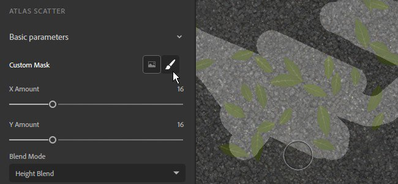

# 버전 2020.2 (2.2)

**Substance Alchemist 2020.2 &quot;우동&quot;**&#x200B;은 단일 이미지 입력을 완전한 PBR 재질로 변환하는 새로운 AI 기반 이미지 재질 변환 프로세스, 개선된 재질 생성 템플릿, 많은 작업 과정 및 사용 편의성 개선, 그리고 새로운 필터와 같은 새로운 콘텐츠를 도입합니다.

출시일: *2020년 6월 15일*

## 주요 기능

### Image to Material(AI 기반)

**이미지를 재질로** 템플릿에 이름이 **AI 기반**&#x200B;인 새 설정이 있습니다. 이러한 새로운 설정은 단일 입력 이미지로부터 고품질의 PBR 재료를 생성하기 위해 더 나은 결과물을 제공한다.

AI 기반 설정은 머신 러닝을 사용하여 모양과 개체를 인식하고 Height 및 일반 정보를 정확하게 생성합니다. 또한 이 설정에는 어두운 영역과 밝은 영역을 제거하기 위한 밝기 감소 필터도 포함되어 있습니다. 이 새로운 설정은 지면, 자갈, 나무껍질, 돌 및 자연 조명으로 비추는 기타 외부 기반 표면으로 훈련되었기 때문에 야외 소재에 가장 적합합니다. 추가 업데이트를 통해 지원되는 소재의 유연성과 활용도가 높아집니다. 자세한 내용은 [전용 문서 페이지](../../filters/tools/image-to-material.md)를 참조하세요.

다음은 두 알고리즘에 의해 생성된 Height 정보와 해당 기본값을 비교한 것입니다.

{width="800px"}

>[!NOTE]
>
> AI 기반 설정에는 특정 하드웨어가 필요합니다. Nvidia GPU가 있는 Windows 및 Linux에서만 사용할 수 있습니다. 자세한 내용은 [기술 요구 사항](../../getting-started/system-requirements.md)을 참조하세요.

### 새 텍스처 가져오기 템플릿

이미지 가져오기 팝업 창은 몇 가지 측면에서 개선되었습니다. **텍스처 가져오기**&#x200B;라는 이름의 새로운 유형의 프로세스도 사용할 수 있습니다.

* **향상된 인터페이스**\
  인터페이스에 업데이트되어 보다 쉽게 사용하고 학습할 수 있으며 각 옵션에 대한 자세한 설명이 제공됩니다.
* **새 텍스처 가져오기 옵션**\
  이제 **텍스처 가져오기**&#x200B;라는 이름의 새 옵션을 사용할 수 있으며 해당 이름을 기반으로 이미지 세트로 직접 가져와 올바른 출력 채널에 연결할 수 있습니다. 기존 이미지 그룹에서 재질을 쉽게 설정할 수 있는 방법을 제공합니다. 자세한 내용은 [전용 문서 페이지](../../features-and-workflows/texture-import.md)를 참조하세요.

### 필터 마스크 입력을 위한 새로운 2D 페인팅

이 버전에서는 이제 외부 이미지를 가져오지 않고도 2D 보기에서 직접 필터 마스크를 페인트하고 편집할 수 있습니다. 그 그림은 자동으로 타일을 칠해 이음매가 없는 재료를 만들 수 있게 한다.

{width="450px"}

* **2D 페인트 모드 시작**\
  2D 페인트 모드를 시작하려면 필터의 속성에서 마스크 이름 옆의 브러시 아이콘을 클릭합니다.

  
* **2D 페인트 도구 모음**\
  페인트 모드 내에 있으면 2D 보기의 맨 위에 다음과 같은 기능과 함께 새 도구 모음이 표시됩니다.

  * **브러시 색상**: 마스크를 페인트하기 위해 브러시 회색 음영 값을 조정합니다.
  * **브러시 펜 크기**: 마스크를 페인트하기 위한 브러시 크기를 조정합니다.
  * **마스크 재설정**: 현재 마스크를 검은색으로 지우면 모든 페인팅 정보가 손실됩니다.
  * **그리기 중지**: 2D 페인트 모드를 종료합니다.

  
* **키보드 바로 가기**\
  페인트 모드에서는 다음과 같은 단축키를 지원하여 페인팅 프로세스를 가속화할 수 있습니다.

  * **X**: 브러시의 현재 회색 음영 값을 반전합니다.
  * **Ctrl + 마우스 휠**: 브러시 크기를 변경합니다.
  * **[ 또는 ]**: 브러시 크기를 변경합니다.

### 새 아틀라스 및 데칼 만들기 모드 단축키

새로운 유형의 Substance 재질을 활용하고 레이어 스택에서 설정을 쉽게 할 수 있도록 두 가지 새로운 생성 모드가 추가되었습니다.

* **데칼 모드**\
  **Alt + 드래그하여 놓기**: 컬렉션에서 재질을 드래그하여 놓을 때 **Alt**&#x200B;를 누르고 유지하면 재질이 데칼 투영 모드에서 자동으로 생성됩니다.
* **아틀라스 모드**\
  **Shift + 드래그하여 놓기**: 컬렉션에서 재질을 드래그하여 놓을 때 Shift 키를 누르고 있으면 Atlas Scatter 모드에서 재질이 자동으로 만들어집니다.

### 새로운 원근 교정 도구

**원근 교정**&#x200B;이라는 새 도구가 필터 목록에 추가되어 이미지의 원근을 조정하거나 보정할 수 있습니다.

* **원근 교정**\
  이 필터를 사용하면 스캔 및 사진 이미지에서 기본값을 수정하여 재질 생성에 더 적합하도록 할 수 있습니다. 이 필터에는 이미지의 초기 모퉁이를 나타내는 4개의 조절점이 있습니다. 점을 이동하여 원근감을 조정/보정합니다.

  

### 향상된 색상 위젯

이제 [매개 변수] 패널에 표시되는 색상 위젯에서 더 많은 컨트롤을 제공합니다.

* **색상 값 도구 설명**\
  마우스를 색상 위젯에 가져가면 현재 색상 값(16진수 형식)을 설명하는 도구 설명이 나타납니다.
* **마우스 오른쪽 단추 클릭**\
  색상 위젯을 마우스 오른쪽 버튼으로 클릭하면 다음 동작이 포함된 새 컨텍스트 메뉴가 표시됩니다.
  * **지우기**: 색상을 검정으로 설정하고 알파 값을 0으로 설정합니다.
  * **복사**: 메모리에 위젯의 현재 색상 값을 복사합니다.
  * **붙여넣기**: 메모리의 현재 색상 값을 위젯에 붙여넣습니다.

### 새 콘텐츠

이 버전에서는 다양하고 새로운 콘텐츠를 제공합니다.

* **새 기본 메시**\
  뷰포트에 재질을 보여줄 수 있는 세 가지 새로운 메시가 있습니다.
  * 신발 모양
  * 남성 티셔츠
  * 여자 티셔츠
* **새 필터**\
  이 버전에는 5개의 새 필터가 있습니다.
  * 균열
  * 이끼
  * 퀼트 스티치
  * 바닥 타일
  * PBR 유효성 검사
* **새 혼합 모드**
* 필터 및 기타 도구가 이제 **채널별 혼합 모드**&#x200B;라는 이름의 새 혼합 모드를 지원합니다. 이 모드를 활성화하면 속성 패널에서 각 채널의 혼합 작업을 조정할 수 있습니다.
* **사전 설정 내보내기**\
  이 릴리스에는 새로 추가되거나 업데이트된 내보내기 사전 설정이 포함되어 있습니다.
  * VStitcher
  * CLO
  * Unity HDRP 템플릿의 DetailMap 지원
