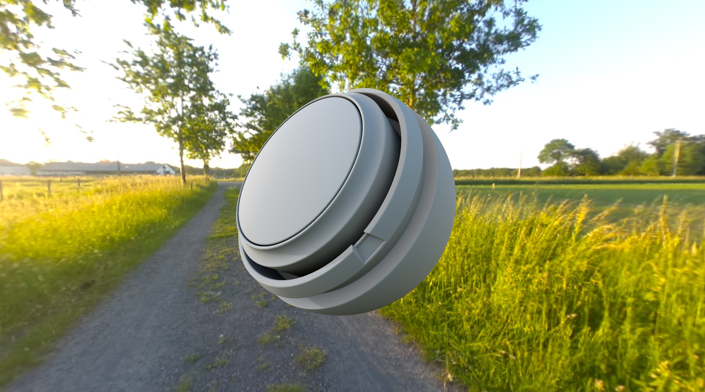
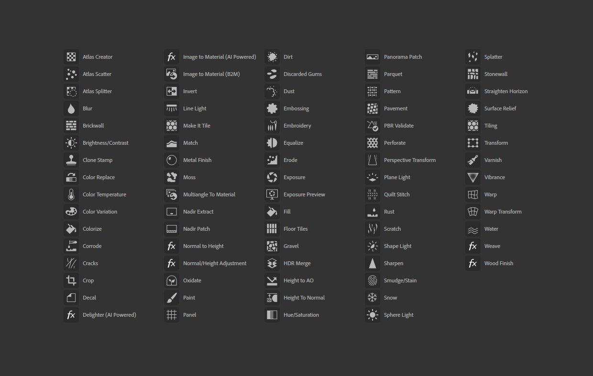

# 버전 3.0

**Substance 3D Sampler 3.0.0**&#x200B;은(는) Adobe Creative Cloud에 연결되어 있으므로 Substance Alchemist의 새 이름입니다. 이를 통해 전체 UI 재작업, 환경 조명 생성 지원, 완전히 재작업된 필터 및 새로운 필터, 보내기 기능 및 ASM 셰이더 지원이 제공됩니다.

출시일: *23 2021년 6월*

## 주요 기능

### 새로운 인터페이스 및 패널 관리

새로운 이름으로, 새로운 모양이 나타납니다. Sampler의 UI가 완전히 개선되어 더 많은 사용자 정의와 더 쉬운 액세스가 허용됩니다.

{width="600px"}

패널은 고정 및 고정 해제할 수 있으므로 이중 화면 설정을 완전히 활용할 수 있습니다.

### 새 프로젝트 작업 과정

Sampler은 이제 프로젝트에서 작동합니다. [프로젝트 패널](../../interface/panels/project-panel.md)을 사용하면 프로젝트별로 에셋을 관리하고 그룹화할 수 있습니다. 프로젝트는 Substance Sampler 파일에 저장되고 쉽게 공유됩니다.

### 새 에셋 패널

[에셋 패널](../../interface/panels/assets-panel.md)은(는) 컬렉션과 결합된 리소스 패널의 새롭고 일반적인 디자인입니다.

* 3 섹션: 스타터 에셋 + 내 에셋 + 연결된 로컬 폴더
* 새로운 에셋 유형 지원: 필터 및 이미지
* 좁은/넓은 보기
* 필터 및 검색

### 새로운 환경 조명 작성

{width="600px"}

이제 Sampler을 사용하여 재질 그 이상을 제작할 수 있습니다. 환경 조명은 [고유한 필터 집합](../../filters/hdri-tools/hdri-tools.md)을 포함하는 새로운 유형의 에셋입니다. [괄호로 묶은 360 사진](../../filters/hdri-tools/hdr-merge.md)에서 시작하거나, 환경 조명을 [처음부터](../../filters/hdri-tools/shape-light.md)하거나, [기존 HDR 파일을 편집](../../filters/hdri-tools/nadir-patch.md)하세요.

### 재작업 및 새로운 필터

{width="600px"}

기존의 모든 필터가 재작업되었습니다.

* 사양/광택 채널 지원.
* 사용자 정의 마스크 지원
* 표준화된 매개 변수 이름
* 거의 모든 필터에 대한 아이콘

조정 필터는 Photoshop을 모방하기 위해 기능에 따라 별도의 필터로 분할되었습니다.

몇 가지 새 필터가 추가되었습니다.

* [변형 뒤틀기](../../filters/tools/warp-transform.md)
* [위브](../../filters/generators/weave.md)
* [패널](../../filters/generators/panel.md)

### 새로운 보내기 기능

이제 Sampler에서 클릭 한 번으로 Substance 3D Painter 및 Stager를 사용하여 [손쉽게 재질 및 빛 환경을 공유](../../interface/panels/share-panel.md)할 수 있습니다.

### 새로운 실시간 렌더링 엔진

* ASM 재질을 지원하므로 더 많은 재질 채널이 있는 응용 프로그램 간에 일관된 모양을 만들 수 있습니다.
* 두 [실시간 엔진](https://helpx.adobe.com/substance-3d/unlisted/documentation/sadoc/viewer-settings-188973164.html) 간 전환
* 메시의 기본 텍스처를 제어하는 기능

### 일반적인 개선 사항

* 새 언어
* 애플리케이션 응답
* 정사각형이 아닌 텍스처 지원
* 도구 실행 취소/다시 실행
* 이미지 가져오기 레이어의 이미지에 사용자 정의 사용 할당
* 매개 변수 값 재설정
* Windows 작업 표시줄에서 진행 상황 내보내기

## 튜토리얼

다음은 새로운 기능에 대한 비디오 튜토리얼입니다.

## 릴리스 정보

### 3.0.0 와플

*(2021년 6월 23일 릴리스)*

**추가됨:**

* [브랜딩] Substance Alchemist이 Adobe Substance 3D Sampler으로 변경됨
* [브랜딩] 새 응용 프로그램 아이콘
* [UI] 새로운 사용자 경험 및 사용자 인터페이스
* [UI] 새로운 화면
* [UI] 인터페이스에서 패널의 도킹과 연결이 해제됨
* [UI] 동일한 열에 최대 3개 패널 고정
* [UI] 동일한 패널에 최대 3개의 패널 고정(탭)
* [UI] 동일한 화면 또는 다른 화면에 별도의 창을 만들기 위해 패널 고정 해제
* [UI] 아이콘을 클릭하면 닫힌 패널이 팝업됩니다.
* [UI] 패널 아이콘을 이동하여 왼쪽 및 오른쪽 막대를 다시 정렬합니다.
* [UI] 직접 특정 필터에 액세스할 수 있는 새 도구 모음(자르기, 변형, 원근감 변형, 복제 도장)
* [UI] 왼쪽 막대의 새 &quot;내용 가져오기&quot; 버튼
* [UI] [내용 가져오기] 버튼을 사용하여 에셋에서 바로 파일 가져오기
* [UI] [내용 가져오기] 버튼을 사용하여 파일을 레이어로 직접 가져오기
* [UI] 컨텐츠 가져오기 버튼을 사용하여 Adobe Substance 3D Assets 웹 사이트에 직접 액세스
* 이제 뷰포트에서 [UI] 해상도 위젯에 직접 액세스할 수 있습니다.
* [UI] 이제 모든 UI 요소가 동적으로 로드됩니다.
* [UI] 바로 가기 - &quot;2&quot;를 사용하여 2D 보기의 가시성을 전환합니다.
* [UI] 바로 가기 - &quot;3&quot;을 사용하여 3D 보기의 가시성을 전환합니다.
* [시작 화면] [새로 만들기] 단추로 클릭 한 번으로 프로젝트 만들기
* [시작 화면] 새 아트워크 배너
* [Project] 이제 모든 프로젝트가 고유한 파일에 연결됩니다.
* [Project] 새 프로젝트 파일 확장명 .ssa
* [프로젝트] 프로젝트로 저장하면 프로젝트를 저장할 위치를 선택하라는 메시지가 표시됩니다
* [Project] Sampler을 닫으면 저장되지 않은 경우 프로젝트를 저장하라는 메시지가 표시됩니다
* [Project] Sampler을 닫으면 마지막 저장 이후 수정 사항이 있는 경우 프로젝트를 저장하라는 메시지가 표시됩니다
* [프로젝트] 프로젝트 이름이 뷰포트 위에 표시됩니다
* [Project] 저장되지 않았거나 마지막 저장 이후 수정 사항이 포함된 경우 프로젝트 이름에 별표가 포함된 기울임꼴이 표시됩니다
* [Project] OS 탐색기에서 직접 .ssa 프로젝트 파일을 엽니다.
* [Project] OS 탐색기에서 .sbsar을 열면 이 .sbsar 파일을 사용할 수 있는 새 프로젝트와 함께 Sampler이 실행됩니다.
* [Project] OS 탐색기에서 .alch(레거시 Substance Alchemist 파일)를 엽니다
* [프로젝트 패널] 프로젝트 내에서 만든 모든 에셋을 포함할 새 패널
* [프로젝트 패널] + 아이콘을 사용하여 에셋(재질 또는 환경 조명) 만들기
* [프로젝트 패널] 에셋을 마우스 오른쪽 버튼으로 클릭하면 컨텍스트 메뉴가 열립니다.
* [프로젝트 패널] 오른쪽 클릭 상황에 맞는 메뉴에서 에셋을 삭제할 수 있습니다
* [프로젝트 패널] 마우스 오른쪽 단추 클릭 상황에 맞는 메뉴에서 에셋을 복제할 수 있습니다
* [프로젝트 패널] 마우스 오른쪽 단추 클릭 상황에 맞는 메뉴에서 에셋의 이름을 변경할 수 있습니다
* [프로젝트 패널] 에셋 간 전환해도 수정 사항이 손실되지 않음
* [해상도] 이제 모든 에셋에 대해 정사각형이 아닌 해상도를 설정할 수 있습니다
* [해상도] 프로젝트 내의 에셋별로 해상도 값이 저장됩니다
* [환경 조명] Substance 3D Sampler 내에서 환경 조명 만들기
* [환경 조명] 환경 조명을 만들 때 이미지를 드래그하여 놓으면 환경 조명 만들기 템플릿 창이 표시됩니다
* [환경 조명] 환경 조명 만들기 템플릿에서 환경 가져오기 를 선택하여 3D 보기의 환경에 이미지를 할당합니다
* [환경 조명] 환경 조명 만들기 템플릿에서 HDR 병합 을 선택하여 노출이 다른 여러 360도 이미지에서 환경 조명을 만듭니다
* [환경 조명] 환경 조명을 만들기 전에 환경 조명 만들기 템플릿에서 &quot;비트맵으로 사용&quot;을 선택하여 이미지를 편집합니다
* [환경 조명] 이미지 가져오기 레이어에서 환경 사용을 할당하여 3D 보기의 환경에 이미지를 직접 할당합니다
* [환경 조명] 환경 채널의 2D 보기에서는 렌더링을 3D 보기에서와 동일하게 표시하도록 자동 색상 교정이 있습니다
* [환경 조명] 환경 조명 생성을 위한 새로운 전용 콘텐츠
* [에셋 패널] [리소스] 및 [필터] 패널이 새 [에셋] 패널에 병합되었습니다
* [에셋 패널] 이제 에셋 패널에서 재질, 필터 및 이미지 등의 에셋 유형을 지원합니다.
* [에셋 패널] 모든 스타터 에셋은 스타터 에셋 섹션에서 액세스할 수 있습니다.
* [에셋 패널] 스타터 에셋 섹션은 읽기 전용입니다
* [에셋 패널] 새로운 &quot;내 에셋&quot; 섹션
* [에셋 패널] &quot;내 에셋&quot; 섹션은 모든 리소스를 가져올 수 있는 곳입니다
* [에셋 패널] &quot;내 에셋&quot;의 모든 에셋이 내 문서의 특정 폴더에 추가됩니다
* [에셋 패널] 에셋 패널에서 로컬 폴더를 연결하여 새 섹션 추가
* [에셋 패널] 검색은 현재 폴더 및 그 하위 폴더에서 검색합니다.
* [에셋 패널] 탐색 경로를 사용하여 폴더와 하위 폴더 간에 이동
* [에셋 패널] 현재 폴더를 재질, 필터 또는 이미지별로 필터링합니다
* [에셋 패널] 여러 필터를 결합하여 재질과 이미지만 가져옵니다
* [에셋 패널] 격자 또는 목록 사이를 전환하여 표시를 변경합니다
* [에셋 패널] 필터는 아이콘으로 표시됩니다
* [에셋 패널] 이미지가 미리 보기로 표시됨
* [에셋 패널] 너비를 늘리면 특정 보기의 패널 레이아웃이 변경되어 폴더 간에 탐색할 수 있습니다
* [에셋 패널] 읽기 전용 섹션이 아닌 경우 에셋을 저장소 아이콘으로 드래그하여 놓아 삭제합니다
* [에셋 패널] 에셋을 마우스 오른쪽 버튼으로 클릭하면 컨텍스트 메뉴가 열립니다.
* [에셋 패널] 마우스 오른쪽 버튼으로 클릭하면 열리는 컨텍스트 메뉴에서 에셋 메타데이터(이름, 범주, 위치)에 액세스합니다
* [에셋 패널] 마우스 오른쪽 버튼으로 클릭할 때 표시되는 컨텍스트 메뉴에서 에셋을 삭제합니다(읽기 전용이 아닌 섹션에서만 사용 가능).
* [에셋 패널] 마우스 오른쪽 버튼으로 클릭할 때 표시되는 컨텍스트 메뉴에서 Adobe Bridge에서 에셋을 검색할 수 있습니다
* [레이어 패널] 새 아이콘을 클릭하여 레이어 위에 기본 재질을 직접 추가합니다
* [레이어 패널] 단축키 - Shift + B를 누르면 레이어 위에 기본 재질이 추가됩니다
* [레이어 패널] 레이어에 축소판 미리 보기(재질 축소판, 필터 아이콘 또는 이미지 미리 보기)가 있음
* [속성 패널] 에셋 이름 및 에셋 썸네일이 있는 [속성] 패널 제목의 새로운 디자인
* [속성 패널] 이제 필터 레이어에서 사전 설정을 지원합니다.
* [속성 패널] 이미지 가져오기 레이어에서 이미지 미리 보기를 마우스 오른쪽 버튼으로 클릭하여 Photoshop에서 이미지를 편집합니다
* [Adobe Bridge] Adobe Bridge에서 에셋을 검색하면 해당 에셋의 위치에서 Bridge가 실행됩니다
* [Adobe Photoshop] Adobe Photoshop에서 편집하면 Photoshop에서 이미지를 편집할 준비가 된 상태로 엽니다.
* [Adobe Photoshop] Adobe Photoshop에서 매번 저장할 때 편집된 이미지는 Sampler에서 다시 로드됩니다.
* [Substance 3D Designer] Adobe Substance 3D Designer에서 보낸 에셋이 에셋 패널의 &quot;내 에셋&quot; 섹션에 직접 도착합니다
* [내보내기] 에셋을 Adobe Substance 3D Painter 및 Adobe Substance 3D Stager으로 직접 보내기
* [내보내기] 재질 및 환경 조명을 Adobe Substance 3D Painter으로 보내기
* [내보내기] 환경 조명을 Adobe Substance 3D Stager으로 보내기
* [렌더링] 이제 새 질감 속성을 지원하고 3D로 렌더링합니다
* [렌더링] 광택 지원(광택 색상, 광택 불투명도 및 광택 거칠음) 추가
* [렌더링] 코팅 지지체 추가 (코팅 색상, 코팅 거칠음, 코팅 표준, 코팅 Specular level 및 코팅 IOR)
* [렌더링] 비등방성 지원 추가(비등방성 레벨 및 비등방성 각도)
* [렌더링] Specular edge color 지원 추가
* [렌더링] 채널 설정 패널에서 이러한 새 속성을 활성화합니다
* [렌더링] Beta에서 새로운 실시간 엔진(2021) 렌더러 소개
* [렌더링] 뷰어 설정 패널에서 두 렌더러 버전 간 전환
* [렌더링] 실시간 엔진(2021) 렌더러는 투명도, 흡수 및 분산 재질 속성을 지원합니다
* [렌더링] 실시간 엔진(2021) 렌더러에는 환경 조명에서 그림자를 계산하는 새로운 방법이 도입되었습니다
* [렌더링] 실시간 엔진(2021) 렌더러는 환경 조명의 조도를 실시간으로 계산합니다
* [셰이더 설정 패널] 특정 재질 셰이더 매개 변수를 조정하기 위한 새 셰이더 설정 패널
* [셰이더 설정 패널] 새 매개 변수(표준 비율, Height 비율, Height 레벨, 방출 강도, IOR, 코트 표준 강도 및 코트 IOR)
* [셰이더 설정 패널] 실시간 엔진 2021에 대한 특정 매개 변수(서브서피스 스캐터링, 스캐터링 거리, 빨강 시프트 및 레일리 스캐터링)
* [셰이더 설정 패널] 설정 값은 에셋별로 저장됩니다
* [뷰어 설정 패널] 기본 환경 조명 미리 보기를 추가했습니다.
* [뷰어 설정 패널] 기본 메쉬의 미리 보기가 추가되었습니다.
* [뷰어 설정 패널] 새 환경 불투명도 매개 변수
* [뷰어 설정 패널] 새 환경 흐림 효과 매개 변수(Realtime Engine 2021 렌더러에만 해당)
* [지역화] 독일어와 프랑스어로 된 새로운 번역
* [콘텐츠] 새로운 기본 스타터 재질
* [Content] 새로운 기본 환경 조명
* [콘텐츠] 모든 필터가 업데이트, 정리 및 최적화되었습니다.
* [콘텐츠] 조정 필터가 여러 개의 필터로 분할되었습니다
* [내용] 새로운 명도/대비 필터
* [콘텐츠] 새로운 색조/채도 필터
* [콘텐츠] 새로운 활기 필터
* [내용] 새로운 선명 효과 필터
* [내용] 새로운 표준/Height 조정
* [콘텐츠] 새 패널 필터
* [콘텐츠] 새로운 스머지 필터
* [콘텐츠] 새로운 직조 필터
* [내용] 새로운 변형 뒤틀기 필터
* [내용] AO 필터에 대한 새 Height
* [내용] 일반 필터에 대한 새 Height
* [콘텐츠] 색상 대체 - 새로 지원되는 채널(광택, 코팅, 비등방성 등)에서 대체
* [콘텐츠] 색상 변형 - 변경할 색상을 정확히 선택하는 수동 모드
* [내용] 타일링 - 이음새 컷을 시각화하는 옵션
* [내용] 타일링 - 완벽한 타일링을 위해 자른 이음새를 페인팅하는 옵션
* [내용] 일치 - 색상 및 거칠기에 맞는 재질을 추가하는 옵션
* [내용] 일치 - 이제 다른 이미지의 색상과 일치하도록 이미지에서 작동합니다
* [콘텐츠] 환경 조명 - 새로운 색상 온도 필터
* [콘텐츠] 환경 조명 - 새로운 노출 필터
* [콘텐츠] 환경 조명 - 새로운 노출 미리 보기 필터
* [콘텐츠] 환경 조명 - 새 Nadir Patch 필터
* [콘텐츠] 환경 조명 - 새 Nadir Extract 필터
* [내용] 환경 조명 - 새 조명 필터(구, 선, 모양, 평면)
* [콘텐츠] 환경 조명 - 새로운 파노라마 패치 필터
* [콘텐츠] 환경 조명 - 새로운 가로 똑바르게 하기 필터
* [콘텐츠] 환경 조명 - 새로운 HDR 병합 필터

**알려진 문제:**

* [Realtime Engine 2021] 레이아웃을 변경하면 응용 프로그램이 충돌합니다
* [Realtime Engine 2021] 대용량 계산, 응용 프로그램 충돌
* [패널] MacOS - 고정 해제된 패널이 모든 애플리케이션 앞에 있음
* [위젯] 변형 및 위치 위젯이 사라질 수 있습니다. 레이어를 숨기거나 숨김 해제하여 표시합니다.
* [내보내기] 환경 조명의 SBSAR 내보내기가 32비트 심도 정밀도를 잃게 됨
* [에셋 패널] 폴더를 열 때 에셋 강조 표시
* [속성 패널] 매개 변수를 재설정해도 콤보 상자 UI가 재설정되지 않습니다.
* [로컬라이제이션] 언어를 변경해도 다시 생성할 때까지 프로젝트 패널에 영향을 주지 않습니다
