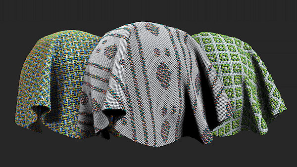

# 버전 3.2

**Substance 3D Sampler 3.2**&#x200B;에서는 재질 물리적 크기, Cloth Weave 및 Channel Switch와 같은 새로운 필터 및 사용자 지정 메타데이터를 만들 수 있는 기능을 캡처하고 처리하는 종단 간 재질 디지털화 작업 과정을 도입했습니다.

출시일: 25 *2022년 1월*

## 주요 기능

### 실제 크기

이 릴리스에는 재료의 물리적 크기를 캡처하고 처리하는 새로운 재료 스캔 워크플로가 도입되었습니다.

디지털 컨텍스트에서 샘플/이미지의 실제 [물리적 크기](../../features-and-workflows/end-to-end-physical-size-workflow.md)를 일치시켜 모든 소프트웨어에서 물리적으로 정확한 자료를 만듭니다.

{width="400px"}

### 헝겊 위브

이번 릴리스에는 새로운 제네레이터가 추가되었습니다. 천 직조를 사용하면 사용자 정의 직조 패턴으로 천 직물을 만들고 디자인할 수 있습니다.

<table>
<tr style="border: 0;">
<td style="border: 0;" valign="top">

{width="390px"}

</td>
<td style="border: 0;" valign="top">

{width="400px"}

</td>
</tr>
</table>

### 사용자 정의 메타데이터

재질에 사용자 정의 메타데이터를 추가합니다. 모든 사용자 정의 메타데이터가 재질 파일(SBSAR)에 포함되어 애플리케이션 간에 디지털 재질을 공유하는 보다 효율적인 작업 과정을 보장합니다.

{width="264px"}

### 채널 전환

이제 [채널 전환]을 사용하여 재질의 출력 맵 채널을 전환할 수 있습니다.

{width="300px"}

### 내보내기

이 릴리스에 새로운 내보내기 기능이 추가되었습니다.

* .sbsar 파일 압축 설정 지정

  {width="400px"}
* .sbs(ar) 파일을 내보낼 때 그래프 유형 설정
* EXR, JPEG, PNG, TARGA, TIFF에 대한 물리적 비율 유지

  {width="400px"}

## 릴리스 정보

### 3.2.0 야키토리

*(2022년 1월 25일에 릴리스됨)*

**추가됨:**

* [물리적 크기] 새 물리적 크기 패널
* [물리적 크기] 자재 생성 템플리트 창에 물리적 크기 옵션을 추가합니다.
* [물리적 크기] 물리적 크기 측정 도구 추가
* [물리적 크기] 물리적 크기 자동 측정 도구 추가
* [물리적 크기] 물리적 크기 진단 도구 추가
* [물리적 크기] 물리적 크기의 z 값 설정 허용
* [물리적 크기] 2D 보기에서 확대/축소 레벨을 설정하는 드롭다운 위젯
* [물리적 크기] 확대/축소 드롭다운 수준의 새로운 &quot;실제 비율로 표시&quot; 옵션
* [물리적 크기] 확대/축소 드롭다운 수준의 새로운 &quot;물리적 크기에 맞추기&quot; 옵션
* [물리적 크기] 2D 보기에서 물리적 크기 표시
* [물리적 크기] 3D 뷰포트에서 물리적 크기 표시
* [물리적 크기] 이미지 가져오기 대화 상자에서 가져온 물리적 크기 맵이 있는 경우 Height 깊이를 표시합니다
* [물리적 크기] 에셋의 컨텍스트 메뉴에 물리적 크기를 표시합니다.
* [물리적 크기] 환경 설정에서 길이 단위 설정
* [물리적 크기] 물리적 비율을 고려하여 텍스처를 내보냅니다
* [메타데이터] 사용자가 제작한 에셋에 사용자 정의 메타데이터를 추가하는 기능
* [내보내기] 사용자 정의 메타데이터를 .sbs(ar) 파일로 내보내기
* [내보내기] 설명, 범주, 작성자 및 태그 메타데이터를 .sbs(ar) 파일로 내보냅니다
* [내보내기] 물리적 크기를 .sbs(ar) 파일로 내보내기
* [내보내기] .sbsar 파일 압축 설정 지정
* [내보내기] 에셋 축소판을 .sbs(ar) 파일로 내보내기
* [내보내기] .sbs(ar) 파일을 내보낼 때 그래프 유형을 설정합니다
* [응용 프로그램] 실시간 엔진 2021을 더 이상 사용할 수 없습니다.
* [응용 프로그램] 실행 취소/다시 실행이 이제 타일링(U,V) 및 Height 비율 슬라이더 변경을 지원합니다.
* [렌더링] 작성된 에셋이 저장될 때 디스크 캐시 생성
* [에셋] Ctrl 키를 누른 상태에서 클릭하여 리소스 패널에서 여러 에셋 유형 필터를 활성화합니다
* [UI] 타일링(U,V) 슬라이더를 잠그는 기능
* [UI] 텍스트 필드에 &quot;복사&quot;, &quot;잘라내기&quot;, &quot;붙여넣기&quot;, &quot;모두 복사&quot; 및 &quot;모두 잘라내기&quot;가 있는 컨텍스트 메뉴를 추가합니다
* [UI] 길이 단위(미터, 인치, 파섹, ...) 레이블 및 텍스트 필드 지원
* [UI] 사용자가 숫자를 표시하는 데 사용되는 소수점 정밀도 를 설정할 수 있습니다
* [UI] 관련된 모든 위치에서 단위를 측정값 팝업으로 사용
* [지역화] 이제 기본 새 에셋 이름이 지역화되었습니다.
* [내용] 새로운 천 직조 생성기
* [Content] 새 채널 전환 필터
* [콘텐츠] 이제 모든 관련 필터가 물리적 크기를 인식합니다
* [콘텐츠] 나무 마감용 새 아이콘
* [Content] 이제 모든 필터가 ASM(Adobe 표준 재질) 채널과 호환됩니다.
* [Content] 이제 필터에 &quot;environment&quot; 변형이 있을 수 있습니다.

**고정:**

* [2D 보기] 채널 제거 시 목록에 남아 있음
* [Application] 운영 체제 파일 탐색기에서 로드한 에셋을 복제할 수 없습니다.
* [Application] 종료 시 충돌 발생
* [Application] 에셋 패널에서 &quot;스타터 에셋&quot;을 클릭하면 때때로 충돌이 발생합니다
* [응용 프로그램] 재질을 삭제할 때 충돌이 발생합니다
* [Application] 환경 변수 &quot;SUBSTANCE\_DISABLE\_SPECIFIC\_FEATURES&quot;가 &quot;0&quot; 또는 &quot;&quot;으로 설정된 경우에도 여전히 활성 상태입니다.
* [응용 프로그램] 여러 재질이 있는 프로젝트를 저장하는 동안 멈춤
* [응용 프로그램] 이미지를 가져오면 충돌이 발생할 수 있습니다
* [애플리케이션] 처음 실행 시 일부 스타터 에셋이 누락됨
* [내보내기] 에셋을 내보내면 충돌이 발생하는 경우가 있습니다
* [레이어] 레이어 패널이 닫혀 있거나 보이지 않으면 이미지를 가져올 수 없습니다
* [레이어] 언어를 변경하면 현재 에셋이 다시 계산됩니다
* [레이어] 가져온 이미지의 사용을 변경해도 사용할 필터 변형이 업데이트되지 않음
* [레이어] 아래 레이어를 수정하면 [이미지에서 재질로(AI) 변환]이 계산되지 않는 경우가 있습니다
* [레이어] [이미지를 재료로(AI)]가 필요하지 않을 때 때때로 다시 계산합니다.
* [레이어] 사용자 정의 필터를 디스크에서 업데이트할 때 업데이트가 권장되지 않습니다.
* [레이어] 표준 채널의 픽셀 포맷이 잘못된 경우가 있습니다.
* [레이어] 일부 레이어는 표시되지 않더라도 여전히 계산됩니다.
* [레이어] 레이어 가시성을 전환할 때 2D 보기 도구가 손상될 수 있습니다
* [레이어] AI(Image to Material)를 사용할 때 UI가 작동을 멈춥니다
* [레이어] 변형 필터 레이어의 가시성을 전환하면 2D 보기 도구가 손상되고 충돌이 발생할 수 있습니다
* [레이어] 레이어 스택에서 레이어를 제거할 때 재계산이 너무 많습니다
* [레이어] 복합 필터에 비정상적인 또는 사용자 정의 입력/출력이 포함되어 있으면 Sampler에서 이를 계산하지 않습니다
* [성능] 에셋 패널이 느리게 열립니다
* [성능] 레이어 스택의 불필요한 재계산 방지
* [성능] 프로젝트 에셋 로드 시간이 너무 오래 걸림
* [성능] 디스크의 렌더링 캐시를 사용할 수 없습니다.
* [성능] 레이어 간 전환이 느립니다
* [성능] 재질 또는 필터 트위킹이 느립니다
* [프로젝트] 종료 시 프로젝트를 저장하면 충돌이 발생할 수 있습니다
* [렌더링] 이미지를 제거하면 모든 출력이 제거될 수 있습니다
* [렌더링] 뷰포트에 표시된 렌더링 시간이 조정할 때 올바르지 않습니다.
* [UI] 필요할 때 내보내기 팝업에서 세로로 스크롤할 수 없습니다.
* [UI] 내보낼 항목이 없을 때 내보내기 팝업을 열 수 있습니다.
* [UI] 일부 팝업은 콘텐츠가 오버플로되는 경우 스크롤되지 않습니다.
* [UI] 텍스트 필드를 클릭하거나 메뉴를 열 때 텍스트 필드가 선택되지 않음
* [UI] 속성 패널의 혼합 모드 이름이 올바르지 않은 경우가 있습니다.
* [UI] 파일 메뉴의 저장 옵션이 회색으로 표시되는 경우가 있습니다.
* [UI] 두 자료의 이름을 변경해도 텍스트 필드가 사라지지 않습니다.
* [UI] 환경 설정 팝업에서 오타

**알려진 문제:**

* [색상 피커] 다른 해상도의 두 번째 모니터에서 색상을 선택하는 기능이 작동하지 않을 수 있습니다
