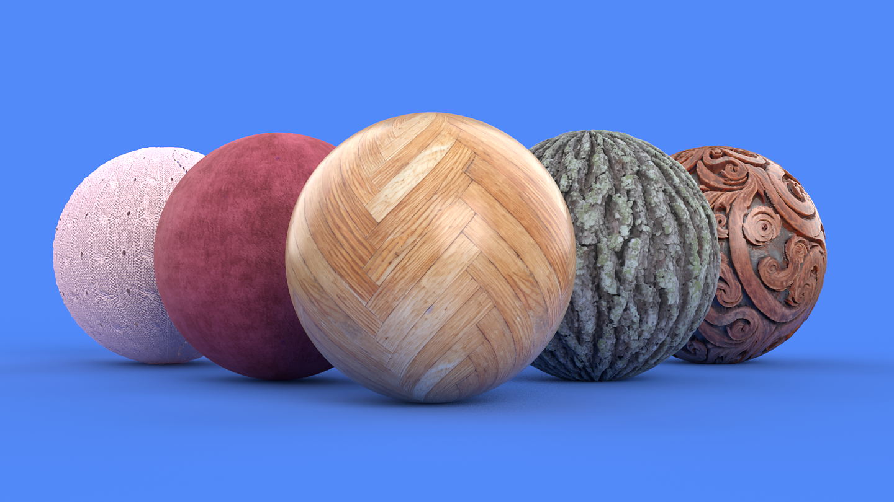
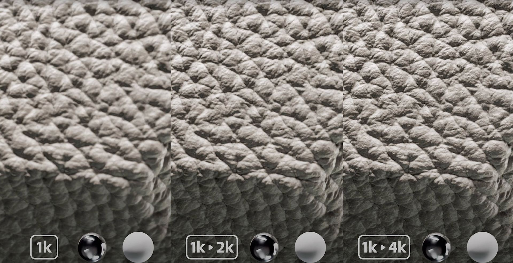

# 버전 4.2

<b>Substance 3D Sampler 4.2</b>에서 새로운 AI 기반 버전 <b>이미지를 재질로 변환</b>과 새로운 <b>AI 확대</b> 기능을 소개합니다. 이 버전에서는 레이어별 해상도를 완벽하게 제어합니다.

*출시일: 2023년 9월 5일*

## 이미지를 재료로 - 새 버전

이미지-재질 은 단일 이미지에서 사용자를 위한 재질 채널(기본 색상, 거칠기, 표준, 변위 및 금속)을 생성합니다.

업데이트된 버전의 Image to Material을 사용하면 재질 생성 및 지원되는 재질 범위가 향상됩니다.

이제 Image to Material은 모든 재질 유형에 대해 교육을 받았으며 Fabric, 플라스틱, 나무 등에 대해 더 나은 결과를 생성합니다.

업데이트된 버전에는 모든 채널을 정확하게 생성하고 범위를 자동으로 조정하기 위해 재질 유형을 선택하는 새로운 매개변수가 있습니다.

## AI 업스케일

새로운 업스케일 레이어 덕분에 Sampler은 에셋(재질 또는 이미지)의 해상도를 2 또는 4로 곱하여 재질 또는 이미지의 기능을 향상할 수 있습니다.

이를 통해 저해상도 텍스처의 품질과 세부 사항을 높이고 텍스처 확대 시 맵 간의 특성 일관성을 유지할 수 있습니다.

업스케일 필터는 재질의 기본 색상, 표준, Height, 거칠기 및 금속 채널을 향상시킵니다.

결과 품질을 최대화하려면 이전 해상도를 변경하지 않고 원래 해상도의 데이터(재질 및 이미지)에 [업스케일] 필터를 사용해야 합니다.

## 레이어 해상도

새로운 레이어 해상도 시스템을 사용하면 각 레이어의 해상도를 완전히 제어할 수 있습니다. 레이어는 문서 크기 또는 아래 레이어의 해상도를 사용합니다.

해상도는 각 레이어에 표시되어 소재의 해상도에 대한 작업의 영향을 쉽게 시각화할 수 있습니다.

이를 통해 재질의 품질을 높일 수 있을 뿐 아니라 에셋에서 작업하는 동안의 성능도 높일 수 있습니다.

## 튜토리얼

## 릴리스 정보

<b>4.2 DORAYAKI</b>

*(릴리스: 2023년 9월 5일)*

<b>추가됨</b>:

* [콘텐츠] 이미지를 재료(AI) 및 흐림 효과 필터로 크게 개선했습니다.
* [콘텐츠] 새로운 업스케일 필터
* [콘텐츠] 이제 자르기 필터에 동적 출력 해상도가 있습니다.
* [재질 생성 템플릿] 문서 크기 설정을 추가합니다.
* [재질 제작 템플릿] 새 &quot;자르기 추가&quot; 토글 버튼.
* [재질 생성 템플릿] 새 &quot;재질 업스케일&quot; 토글
* [재질 생성 템플릿] 가져온 이미지 크기를 표시합니다.
* [재질 제작 템플릿] 가져온 이미지 중 일부를 사용할 수 없는 경우 피드백 제공
* [재질 생성 템플릿] 이미지 크기가 일관되지 않을 때 경고
* [재질 생성 템플릿] 새 경고 및 도구 설명
* [레이어] 레이어 스택의 레이어 해상도를 표시합니다.
* [레이어] 이제 레이어 계산 해상도를 문서 크기 또는 입력 크기로 설정할 수 있습니다.
* [레이어] 레이어 스택의 레이어 해상도 표시
* [레이어] 해당되는 경우 레이어 해상도 정책을 문서 또는 레이어 입력으로 전환합니다.
* [레이어] 업스케일 필터가 수동으로 추가되면 사용자에게 경고하고 몇 가지 설명서를 제공합니다
* [레이어] 선형 업스케일을 수행할 때 사용자에게 경고하고 대신 업스케일 필터를 사용하라고 제안합니다
* [레이어] 이제 AI(Image to Material) 레이어 계산을 더 빠르게 취소할 수 있어 레이어 스택을 조정할 때 렌더링 시간이 향상됩니다
* [레이어] 이제 레이어 스택을 조정할 때 렌더링 시간을 개선하기 위해 확대 레이어 계산을 더 빨리 취소할 수 있습니다
* [내보내기] 내보낸 텍스처의 재정의 해상도 허용
* [내보내기] 이제 내보낼 채널 목록이 정렬됩니다.
* [내보내기] 내보낼 채널 목록에 채널 해상도 표시
* [응용 프로그램] GPU 가속 신경망을 활성화하거나 비활성화하는 새 환경 설정
* [UI] 해상도 드롭다운이 개선됨
* [UI] 메쉬 변형, 메쉬 포스트 프로세스 및 직조 필터용 새 아이콘
* [UI] &quot;공유&quot; 패널의 이름을 &quot;내보내기&quot;로 변경
* [스크립팅] 내보내기 API에 레이어 출력 해상도 지원 추가
* [스크립팅] 이미지 가져오기 API에 자르기, 확대 및 문서 크기 추가
* [온보딩] 새 튜토리얼
* [온보딩] 시작 및 새로운 기능 화면 콘텐츠 업데이트
* [엔진] 버전 9.0.1로 Substance 엔진 업데이트

<b>고정:</b>

* [3D 캡처] 정렬 설정 매개 변수의 정밀도 옵션 이름 지정 개선
* [응용 프로그램] 16차원이 아닌 이미지를 가져오면 충돌이 발생할 수 있습니다
* [Application] [프로젝트] 패널에서 에셋을 복제할 때 충돌이 발생합니다
* [애플리케이션] [프로젝트] 패널에서 에셋을 전환할 때 충돌 발생
* [내용] Snow 필터에 대한 사용자 정의 마스크 페인팅이 제대로 작동하지 않습니다
* [노출 매개변수] 재료를 전환할 때 노출된 매개변수 변경 사항이 손실될 수 있습니다.
* [상호 운용성] 내보내기 패널에서 자료를 보내면 충돌이 발생할 수 있습니다
* [레이어] 내용 인식 채우기를 사용하면 단일 이미지 입력에서 질감 입력으로 전환할 때 컴퓨팅이 중지됩니다.
* [레이어] 재질이 포함된 환경 조명을 복제한 후 충돌이 발생합니다
* [레이어] 이미지 파일의 이름을 변경한 경우 이미지 가져오기 레이어가 [속성] 패널에 잘못된 이미지 이름을 표시합니다
* [레이어] 비활성 레이어에 회전자가 표시되는 경우가 있습니다
* [레이어] 이미지 가져오기 레이어에서 이미지의 출력 사용을 변경하는 것이 작동하지 않는 경우가 있습니다
* 작성 템플릿 창의 [레이어] 오타
* [UI] 3D 뷰포트 온보딩 도구 설명에 포커스 문제 있음
* [UI] 파일 이름이 너무 길면 이미지 이름이 오버플로될 수 있습니다.
* [UI] 지우개를 사용할 때 보조 브러시 도구 모음 레이아웃 문제
* [UI] 뷰어 설정 패널에서 일부 언어의 문자열이 잘립니다
* [UI] 뷰포트 도구 설명 팝업이 표시되는 동안 &quot;space&quot;를 누르면 새 프로젝트가 생성됩니다.
