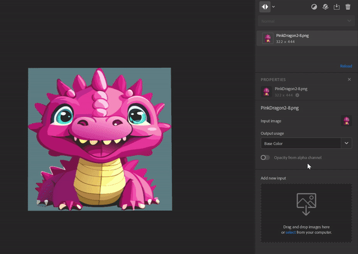

# 버전 4.3

<b>Substance 3D Sampler 4.3</b>에서는 <b>텍스처 생성기</b>, 새 버전의 <b>자수</b> 필터, <b>원근 자르기</b> 도구를 포함한 새로운 스타터 콘텐츠를 소개합니다.

*출시일: 2024년 1월 25일*

## 새로운 스타터 에셋 콘텐츠

Sampler에 포함된 재질이 <b>산업 디자인</b> 워크플로, <b>패션 </b>워크플로 및 미디어와 엔터테인먼트에서 작업하는 기술 아티스트의 요구 사항을 더 잘 충족하도록 업데이트되었습니다. 이제 텍스처를 만드는 기술적인 측면을 더 많이 제어할 수 있습니다.

## 텍스처 생성기

새 텍스처 생성기를 사용하면 <b>매개 변수 노이즈, 패턴 </b>및<b> 그런지</b> 옵션을 사용하여 재질 생성을 보다 효율적으로 제어할 수 있습니다.  생성된 이미지를 마스크 또는 채널 맵에서 사용할 수 있어 기술 및 크리에이티브 팀이 재료 디자인에 대한 공동 작업을 그 어느 때보다 쉽게 수행할 수 있습니다.

새 필터링 아이콘을 사용하여 텍스처 생성기만 구문 분석합니다.

## 자수

업데이트된 자수 필터는 스티칭 정밀도가 향상되었으며 최대 8가지 색상을 지원합니다. 재질의 입력은 다시 레이어 스택에 있으며, 이를 통해 패치에 다른 메타 데이터를 삽입할 수 있습니다.

## 원근 자르기

새로운 원근 자르기 도구를 사용하면 4개의 조절점으로 왜곡된 재질과 스캔을 잘라 원근 아티팩트를 제거하고 타일링 가능한 에셋을 얻을 수 있습니다.

## 스타일화

스타일화 필터를 사용하면 모든 재질에 스타일을 적용하여 손으로 그린 것처럼 보이게 할 수 있습니다.

## 채우기 필터의 혼합 모드

채우기 필터의 업그레이드 버전에는 혼합 모드가 포함되어 있어 값, 입력 맵 또는 채우기의 텍스처 생성기를 아래 레이어의 채널 결과와 곱할 수 있습니다.

## 이미지 가져오기 레이어 개선 사항

이미지 가져오기 레이어에 여러 이미지를 추가하고 이미지의 Alpha 채널에서 불투명도 맵을 생성할 수 있습니다.

## 릴리스 정보

*(릴리스: 2024년 1월 25일)*

<b>추가됨</b>:

* [에셋] 새로운 에셋 유형: Texture Generators
* [Assets] Starter Assets에 포함된 새 자료
* [에셋] 속성 패널의 이미지 매개 변수에 대한 새 에셋 선택기
* [에셋] [에셋] 패널의 텍스처 생성기를 [속성] 패널의 이미지 선택기로 드래그하여 놓습니다
* [에셋] 운영 체제 파일 탐색기에서 텍스처 생성기를 끌어서 놓습니다.
* [에셋] 필터는 이미지 입력의 사용자 태그를 통해 맞춤 생성기를 제안할 수 있습니다.
* [에셋] 텍스처 생성기에서 사용자 태그를 통해 제안할 필터를 정의할 수 있습니다.
* [콘텐츠] 새로운 원근 자르기 필터
* [콘텐츠] 새로운 스타일화 필터
* [내용] 칠 필터의 혼합 모드
* [Content] 자수 필터 업데이트됨
* [내용] 업데이트된 페인트 감싸기 필터
* [콘텐츠] 텍스처 생성기를 지원하도록 모든 필터를 업데이트했습니다.
* [레이어] 레이어 스택에 텍스처 생성기 출력 채널을 추가할 때 이를 선택하는 기능
* [레이어] 텍스처 생성기에서 사전 설정을 쉽게 나열하고 적용하는 기능
* [레이어] 이미지 피커에서 텍스처 생성기 미리 보기를 표시합니다.
* [레이어] 텍스처 생성기 매개 변수를 노출하고 내보낼 수 있습니다.
* [레이어] 텍스처 가져오기 생성 템플릿을 사용하여 단일 이미지를 가져올 때 기본 색상 사용을 할당합니다
* [레이어] 호환되지 않는 파일을 속성 패널의 이미지 선택기에서 드래그하여 놓으려고 할 때 피드백 발생
* [레이어] 가져온 이미지의 알파 채널에서 불투명도 채널을 생성합니다
* [레이어] [이미지를 재료로(AI)]로 설정하면 범주를 변경할 때 더 빠르게 계산할 수 있습니다
* [레이어] 만들기 템플릿 사용 후 가장 관련 있는 레이어 선택
* [레이어] 이제 고급 매개 변수 그룹의 슬라이더로 위치 위젯을 변경할 수 있습니다.
* [내보내기] Raw 번호 대신 대기열에 백분율을 표시합니다.
* [상호 운용성] 이제 Painter으로 보낼 때 불투명도 채널이 알파 채널로 인식됨
* [응용 프로그램] 하드웨어 정보를 표시하고 저장하는 새 대화 상자
* [응용 프로그램] 모든 프로젝트의 기본 Height 배율을 변경하는 새 환경 설정
* [애플리케이션] 오래된 에셋의 표시 방식 개선
* [스크립팅] 새로운 asset.documentResolution() 및 asset.documentResolution() 함수
* [스크립팅] 새 select\_asset() 함수
* [스크립팅] 텍스처 생성기용 Python API
* [스크립팅] get\_project\_assets()가 이제 3D 개체를 반환합니다.
* [UI] 에셋 패널에서 에셋 축소판 크기를 변경할 수 있습니다.
* [UI] 뷰포트 표시 아이콘 업데이트됨

<b>고정:</b>

* [2D 보기] 마우스 휠을 사용한 확대/축소가 244%에서 차단됨
* [Application] 그래픽 API를 초기화할 때 시작할 때 충돌이 발생합니다
* [Application] 프로젝트 이름에 # 문자가 포함된 경우 충돌이 발생합니다
* [응용 프로그램] 이전 프로젝트를 열 때 충돌이 발생할 수 있습니다.
* [응용 프로그램] 현재 프로젝트를 다시 열면 충돌이 발생할 수 있습니다
* [응용 프로그램] 일부 프로젝트 변경 사항이 등록되지 않았으며 저장되지 않은 경우 프로젝트를 닫을 때 경고 없이 유실됩니다
* [내보내기] .sbs/.sbsar에서 동일한 이름의 여러 파일을 사용할 때 내보내기 문제
* [내보내기] 내보낸 회색 음영 이미지 .sbs/.sbsar 파일의 색상 공간이 잘못되었습니다.
* [Filters] 불투명도 혼합 비헤이비어 문제
* [레이어] .svg 파일이 적절한 해상도로 렌더링되지 않는 경우가 있습니다
* [성능] 일부 프로젝트 저장이 디스크에 필요하지 않습니다.
* [Project] 이전 프로젝트를 가져오면 연결된 사전 설정이 로드되지 않음
* [스크립팅] 첫 번째 삽입된 레이어의 매개 변수를 가져올 수 없습니다.
* [UI] 에셋에 마우스를 가져가면 미리보기 팝업이 잘못된 위치 또는 화면에 나타날 수 있습니다
* [UI] 시작 화면의 맨 위에 고정 해제된 패널이 표시되고 사용할 수 있습니다
