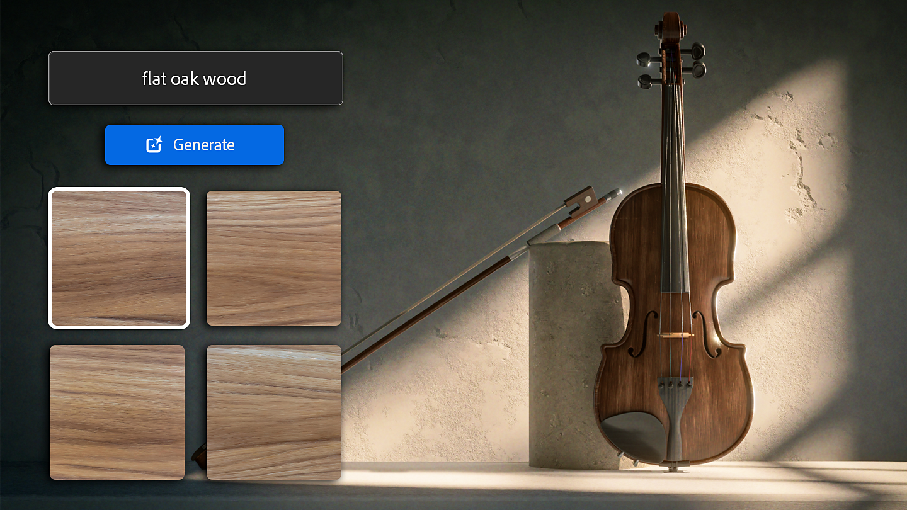
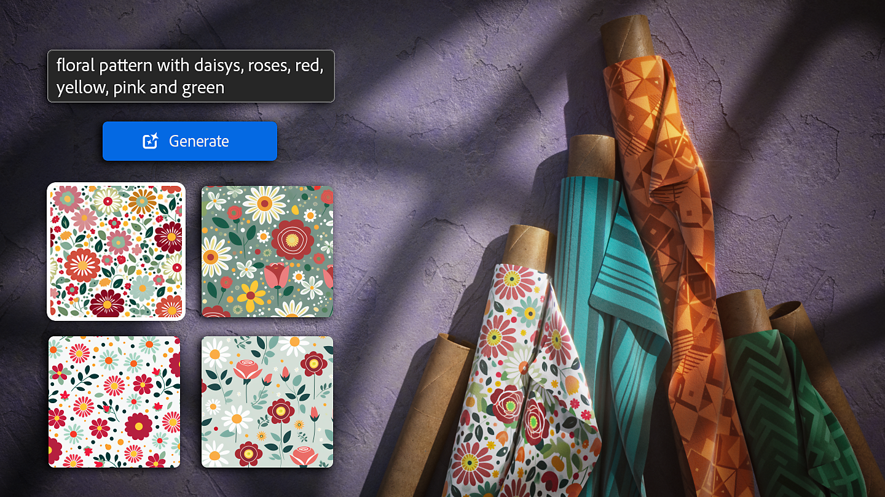

# 버전 4.4

<b>Substance 3D Sampler 4.4</b>에서는 세 가지 새로운 생성 워크플로(Text-to-Texture, Text-to-Pattern, Image-to-Texture)를 도입했습니다.

<b>생성형 인공지능 기능은 Adobe 계정이 필요하므로 Adobe 버전</b>에서만 사용할 수 있습니다. 따라서 이러한 기능은 <b>Steam에서 사용할 수 없습니다</b>.

*출시일: 2024년 5월 23일*

## 텍스트를 텍스처로

Text-to-texture를 사용하면 <b>텍스트 프롬프트</b>를 사용하여 재질을 만드는 새로운 방법을 탐색할 수 있습니다. 자세한 텍스트 설명에서 타일 텍스처를 생성하고 Image-to-Material 또는 Sampler 필터를 사용하여 원하는 결과를 만들어 낼 수 있습니다.

## Image-to-texture

Image-to-texture를 사용하면 정사각형이 아니고 타일링이 아니든 관계없이 <b>사용자 고유 참조 이미지</b>에서 바둑판식 정사각형 텍스처를 만들 수 있습니다. 이렇게 하면 완벽한 프롬프트를 작성할 필요 없이 원하는 결과에 더 가까워집니다.\
Image-to-Texture를 사용하면 이미 만든 콘텐츠에서 변형을 만들어 시간을 절약할 수도 있습니다.

## Text-to-pattern

텍스트 패턴 변환 기능은 <b> 텍스트 프롬프트</b>을 사용하여 정사각형 타일링 패턴을 생성합니다. 그런 다음 직물 직조 필터를 사용하여 기본 색상으로 사용하여 원래 직물 재료를 만들고 패턴 필터 등의 입력으로 사용할 수 있습니다.

## 릴리스 정보

*(릴리스: 2024년 5월 23일)*

<b>추가됨</b>:

* [Application] 이제 3D 캡처 캐시가 별도의 하위 폴더에 저장됩니다
* [생성형 인공지능] 이미지를 텍스처로(베타)
* [생성형 인공지능] 텍스트로 패턴(베타)
* [생성형 인공지능] 텍스트를 텍스처로 변환(베타)
* [스크립팅] 이제 에셋에 &#39;리소스&#39; 속성이 있습니다.
* [스크립팅] 이제 레이어에 &#39;출력\_사용량&#39; 속성이 있습니다.

<b>고정:</b>

* [Application] 손상된 프로젝트 파일을 열 때 충돌이 발생함
* [Application] 프로젝트에 손상된 에셋이 포함된 경우 충돌이 발생합니다
* [응용 프로그램] Windows에서 모니터 플러그를 뽑으면 충돌이 발생합니다
* [응용 프로그램] Windows 작업 표시줄의 응용 프로그램 아이콘이 잘못되었습니다.
* [응용 프로그램] 기본 구성 파일 손상으로 인해 파일이 삭제될 수 있습니다.
* [응용 프로그램] 팝업 앞에 패널 표시
* [내용] 텍스처 생성기의 축소판이 흐립니다
* [내보내기] .sbs/.sbsar를 내보낼 때 가져온 이미지에서 생성된 불투명도 채널
* [Filters] 입력 레이어에 따라 확대/축소가 충돌할 수 있습니다
* [생성형 인공지능] 서비스에서 예기치 않은 결과를 받으면 충돌이 발생할 수 있습니다
* [스크립팅] 환경 변수에서 플러그인을 자동으로 로드할 때 충돌이 발생합니다
* [스크립팅] API를 사용하여 출력 사용을 할당할 때 충돌이 발생할 수 있습니다.
