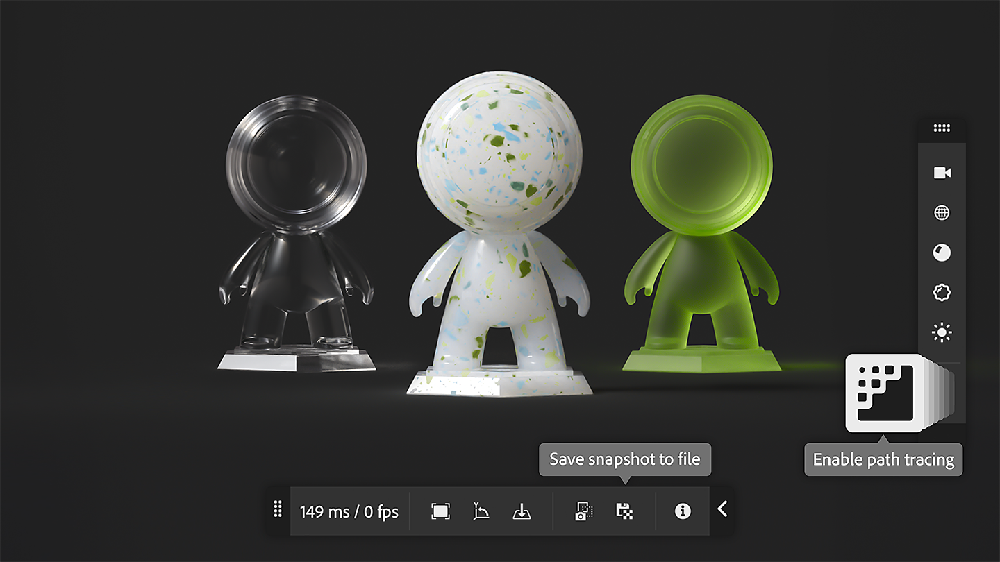

# 버전 5.0

<b>Substance 3D Sampler 5.0</b>에서는 고품질 스캔 및 렌더링을 사용하여 재질의 디지털 트윈을 쉽게 사용할 수 있는 방법을 소개합니다.

주요 새로운 기능은 다음과 같습니다.

## 빠른 작업

한 번의 클릭으로 Sampler의 모든 기본 워크플로를 시작하고 레이어 스택을 준비합니다!

추가 정보 *[여기](../interface/panels/quick-actions-panel.md)*.

## 새 홈 화면 레이아웃

모든 프로젝트, 튜토리얼을 찾아 홈 페이지에서 바로 작업을 시작하세요.

추가 정보 *[여기](../interface/the-home-screen.md)*.

## 새 렌더러

시각적 일관성을 향상시키고 새로운 재질 속성을 지원하는 실시간 및 경로 추적 중에서 선택할 수 있습니다. 3D 보기에서 직접 작업 스냅숏을 저장합니다.

추가 정보 *[여기](../interface/2d-and-3d-viewport.md)*.

## HP Z Captis 통합

HP Z Captis 및 Substance 3D Sampler을 사용하면 실제 자료를 단 몇 분 안에 디지털로 변환할 수 있습니다.

기업, 팀 및 교육 계정에서 사용할 수 있는 기능입니다.

추가 정보 *[여기](../pipeline-and-integrations/hp-z-captis-support/hp-z-captis-support.md)*.

## V5.0 릴리스 노트

*(릴리스: 2025년 2월 20일)*

<b>추가됨</b>:

* [온보딩] 학습 콘텐츠, 샘플 프로젝트, 빠른 작업 및 최근 프로젝트에 빠르게 액세스할 수 있는 새 홈페이지.
* [온보딩] 홈페이지 및 전용 패널에서 액세스할 수 있는 새로운 빠른 작업으로 빠르게 시작합니다
* [온보딩] [콘텐츠] 빠른 작업은 레이어 스택을 가장 많이 사용하는 레이어로 채우는 미리 정의된 워크플로우입니다
* [온보딩] 빠른 작업 또는 사용자 정의 프로젝트를 통해 새로운 빠른 시작 메뉴를 통해 새 프로젝트를 만들 수 있습니다.
* [온보딩] 전용 버튼을 통해 홈페이지에서 직접 빈 프로젝트를 만들 수 있습니다.
* [3D 보기] 새로운 렌더링 기능(코팅, 광택, 투명도, 표면 아래 분산 등의 속성)과 Substance 에코시스템 전반의 시각적 일관성을 제공하는 새로운 고급 래스터라이저와 패스파트레서
* [3D 보기] 이제 3D 보기에서 뷰어 설정에 직접 액세스할 수 있습니다.
* [3D 보기] 렌더링 스냅샷을 클립보드 또는 파일에 저장할 수 있습니다
* [3D 보기] 장면 원점을 시각화하기 위한 격자 표시
* [3D 보기] 그라운드 평면에서 그림자와 반사를 포착할 수 있습니다.
* [3D 보기] 그라운드 평면의 반사 및 불투명 정도를 제어합니다
* [3D 캡처] 바닥에 망 배치
* [응용 프로그램] 응용 프로그램 시작 시 하드웨어 호환성 확인
* [응용 프로그램] 이제 충돌이 발생한 직후에 충돌 보고 창이 열립니다.
* [Content] 샘플 프로젝트를 열어 쉽게 시작하세요.
* [내보내기] USD 파일에서 Adobe Standard Material 셰이더 내보내기
* [생성형 인공지능] 이미지를 [텍스처] 작업 과정에 대한 이미지의 입력으로 사용할 때 &quot;추론하지 않음&quot; 태그를 확인합니다.
* [프로젝트] 프로젝트를 더 빠르게 열 수 있도록 프로젝트 파일 내에 축소판이 저장됩니다
* [프로젝트] 캐시 데이터를 프로젝트 파일 내에 다른 모드(캐시 없음, 라이트 캐시, 전체 캐시)로 저장하도록 환경 설정에서 설정합니다.
* [스크립팅] [변경 중단] Qt6.15로의 Qt 마이그레이션 - 기존 플러그인의 호환성 영향
* [스크립팅] 이제 기본 플러그인 및 스크립트 폴더가 Documents 폴더에 있습니다.
* [스크립팅] 메인 Sampler 패널과의 시각적 일관성을 위한 플러그인용 새로운 UI
* [스크립팅] Sampler 플러그인 기능을 살펴보려면 2가지 플러그인 예제에 액세스하십시오
* [스크립팅] 새 open\_3d\_catpure() 함수
* [스크립팅] 레이어를 삽입할 때 대상 위치의 위나 아래에 삽입되는지 제어합니다

<b>고정:</b>

* [3D 캡처] macOS에서 개체 캡처를 시작할 수 없는 경우 충돌이 발생함
* [Application] 종료 시 충돌 발생
* [애플리케이션] 프로젝트 패널에 에셋을 추가하는 동안 종료 시 멈춤
* [응용 프로그램] Enter 키를 누르지 않으면 프로젝트 에셋의 이름을 바꿀 수 없습니다.
* [응용 프로그램] 실행 취소 및 다시 실행 메뉴 항목이 비활성화되어야 할 때 비활성화되지 않습니다.
* [에셋] 에셋 패널의 모든 라이브러리 섹션에서 에셋을 삭제할 수 없음
* [콘텐츠] Atlas creator - 기존 불투명도 맵이 있는 경우 사용
* [콘텐츠] 색상 ID 혼합 - 기본 색상의 색상 피킹 수정
* [레이어] 생성기 사용 시 불필요한 계산을 피하십시오.
* [레이어] 생성기를 수정하면 너무 많은 계산이 트리거될 수 있습니다
* [성능] GPU 메모리 관리 개선
* [성능] 앱을 다시 시작할 때 렌더링 캐시를 사용할 수 없음
* [리소스] 읽기 전용 파일이 에셋 패널에 표시되지 않습니다.
* [스크립팅] 다른 레이어를 추가한 후 레이어 재사용 허용
* [스크립팅] 하나의 스크립트에서 레이어 스택 구조를 여러 번 변경하면 실패할 수 있습니다

<b>제거됨:</b>

* [응용 프로그램] .dng 및 .nef 이미지 파일에 대한 지원 제거
