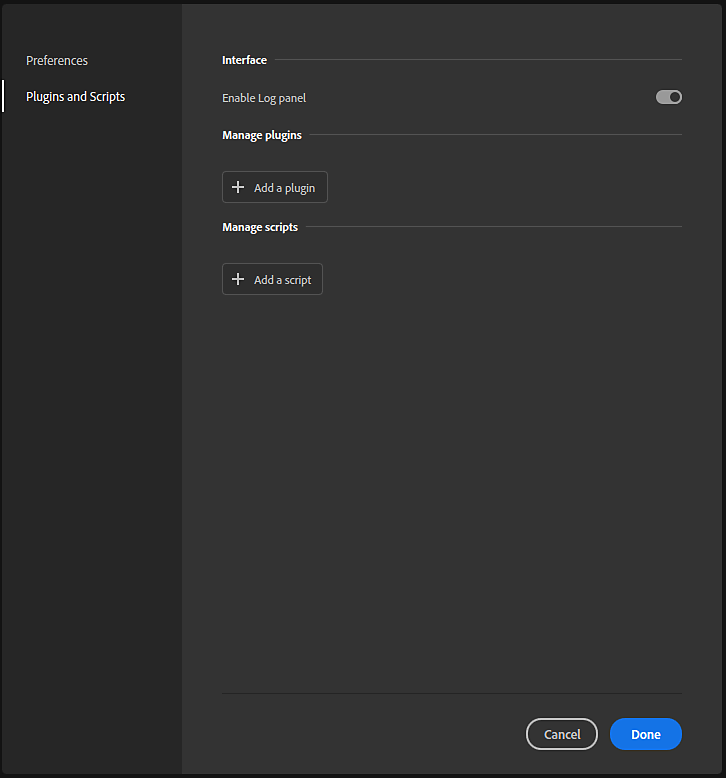

# 설치된 플러그인 및 스크립트 관리

플러그인을 설치, 수정 또는 제거하려면 편집 > 환경 설정을 사용한 다음 플러그인 및 스크립트 를 선택합니다.

플러그인 및 스크립트 패널에서 플러그인의 출력을 표시하는 로그 패널을 활성화할 수 있습니다. 이 기능은 문제 해결 및 디버깅에 유용할 수 있습니다. 활성화되면 Sampler 메인 인터페이스의 오른쪽 막대에서 로그 패널을 열 수 있습니다. [로그] 패널은 다른 Sampler 패널과 마찬가지로 고정될 수 있습니다.

## 플러그인과 스크립트 비교

플러그인과 스크립트의 주요 차이점은 플러그인에 스크립트가 포함되지 않은 UI 요소가 포함되어 있다는 것입니다. 플러그인은 적어도 PY 및 QML 파일이 필요합니다. QML 파일은 UI 요소를 정의하는 반면 PY 파일은 플러그인의 동작을 정의합니다. 반면 스크립트는 PY 파일로만 구성됩니다.

플러그인의 UI 요소는 매개 변수를 사용하여 플러그인의 동작을 수정할 수 있음을 의미합니다. 예를 들어 자동 저장 플러그인의 예는 자동 저장 사이의 시간을 수정할 수 있는 컨트롤을 포함합니다. 플러그인은 Sampler 인터페이스의 일부가 되며 표준 Sampler 패널처럼 고정하고 이동할 수 있습니다.

스크립트는 이러한 수준의 유연성을 허용하지 않지만 지정된 작업을 수행합니다. 예를 들어 [모두 내보내기] 스크립트는 호출될 때마다 항상 동일한 방식으로 작동합니다. 상단 메뉴 막대에서 스크립트에 액세스할 수 있습니다. Sampler에 스크립트를 추가한 후에만 스크립트 메뉴를 사용할 수 있습니다.

## 플러그인 관리

기본적으로 사용 가능한 옵션은 &quot;플러그인 추가&quot;뿐입니다. 그러면 로드할 PY 파일을 선택할 수 있는 파일 탐색기가 열립니다.

>[!NOTE]
>
> 플러그인이 작동하려면 PY와 QML 파일이 모두 필요합니다. 가져올 PY 파일을 선택하면 Sampler이 폴더에서 QML 파일을 검색합니다. QML 파일이 없으면 플러그인 로드가 실패합니다.

플러그인을 설치하면 다음과 같은 몇 가지 옵션을 사용할 수 있습니다.

* 플러그인 왼쪽의 핸들을 드래그하여 플러그인을 재정렬할 수 있습니다.
* 토글 스위치를 사용하여 플러그인을 켜거나 끕니다.
* 각 플러그인의 오른쪽에 있는 메뉴 버튼을 사용하여 플러그인의 폴더 위치를 다시 로드하거나 제거하거나 열 수 있습니다.

설치된 플러그인은 처음에 Sampler 메인 인터페이스의 오른쪽 막대에 표시됩니다. 여기에서 표준 Sampler 패널과 마찬가지로 플러그인 패널을 열고, 고정하고, 이동할 수 있습니다.

## 스크립트 관리

스크립트는 플러그인과 유사하게 관리할 수 있습니다.

스크립트를 설치하면 다음과 같은 몇 가지 옵션을 사용할 수 있습니다.

* 스크립트 왼쪽에 있는 핸들을 사용하여 스크립트 순서를 변경합니다.
* 토글 스위치를 사용하여 스크립트를 켜거나 끕니다.
* 각 스크립트의 오른쪽에 있는 메뉴 버튼을 사용하여 스크립트를 제거하거나 스크립트의 폴더 위치를 엽니다.
* 스크립트를 가져오면 **%\AppData\Roaming\Adobe\Adobe Substance 3D Sampler\scripts**&#x200B;에 복사됩니다.
* 스크립트를 편집하려면 Sampler에서 복사한 스크립트를 수정해야 합니다
